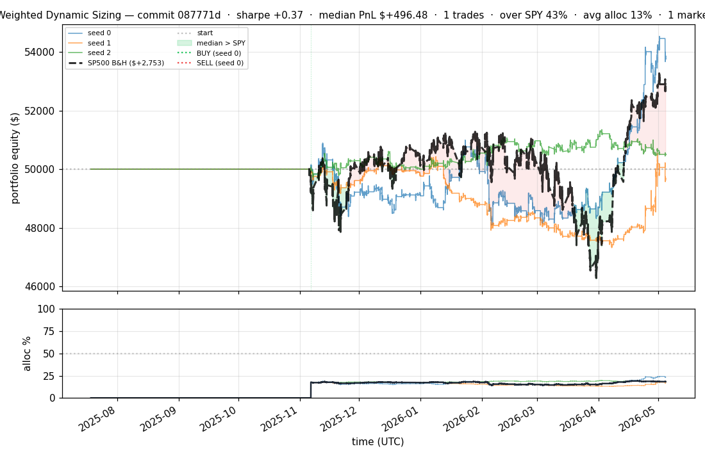
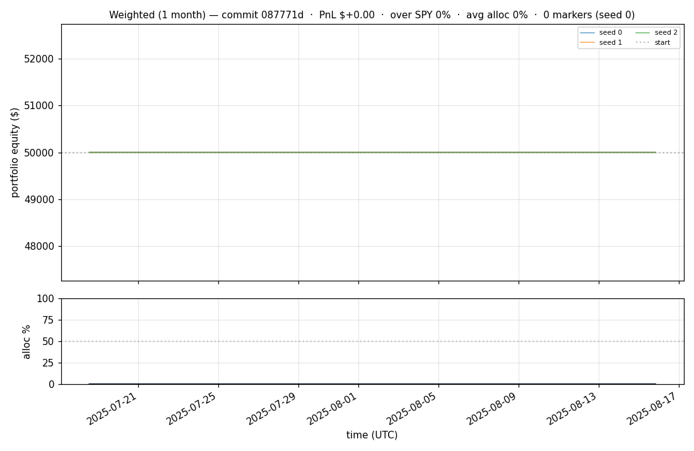
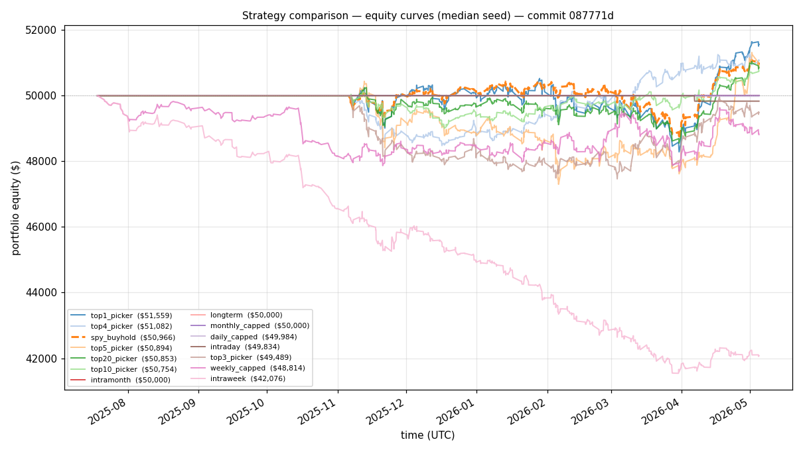
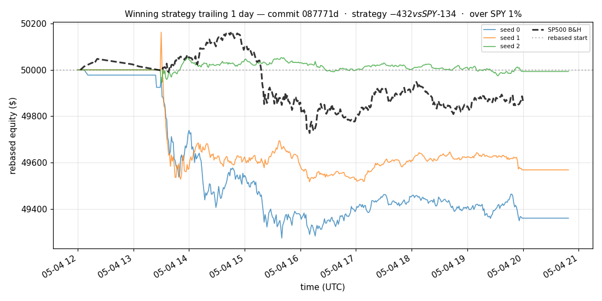
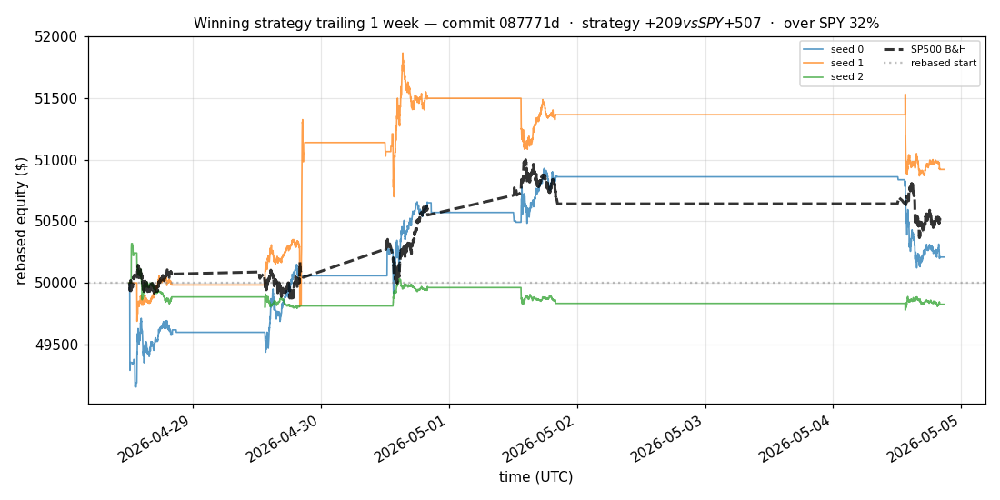
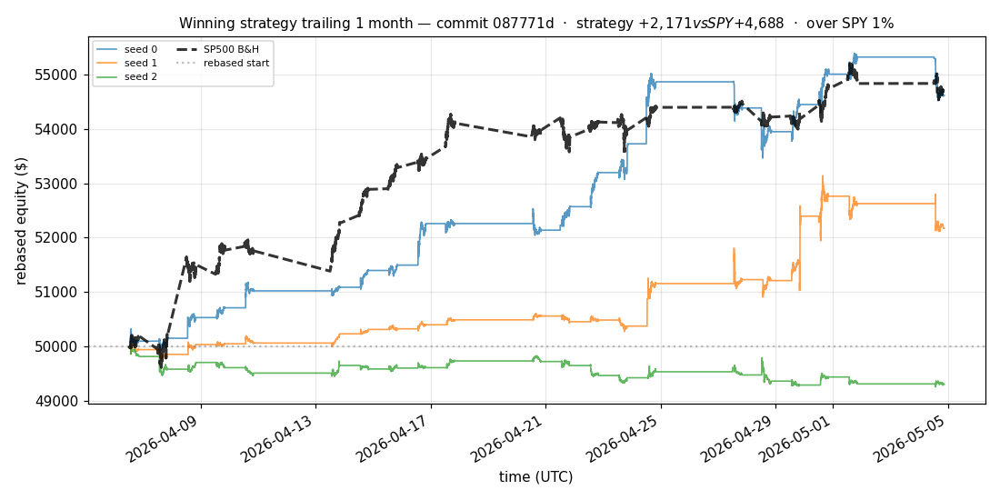
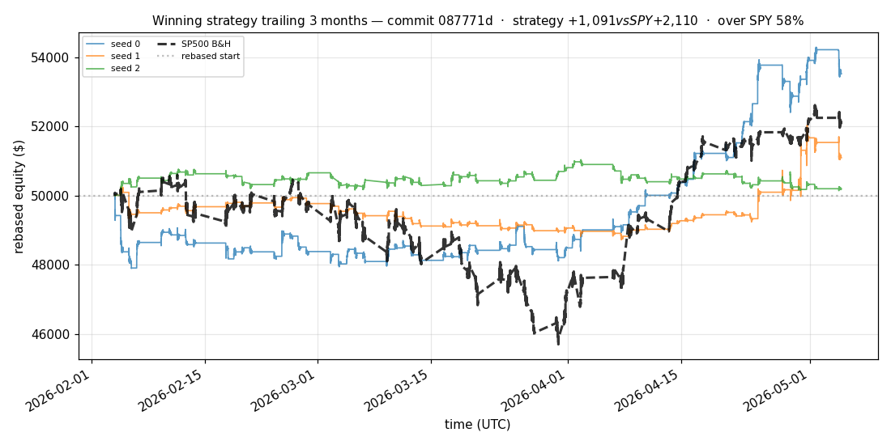
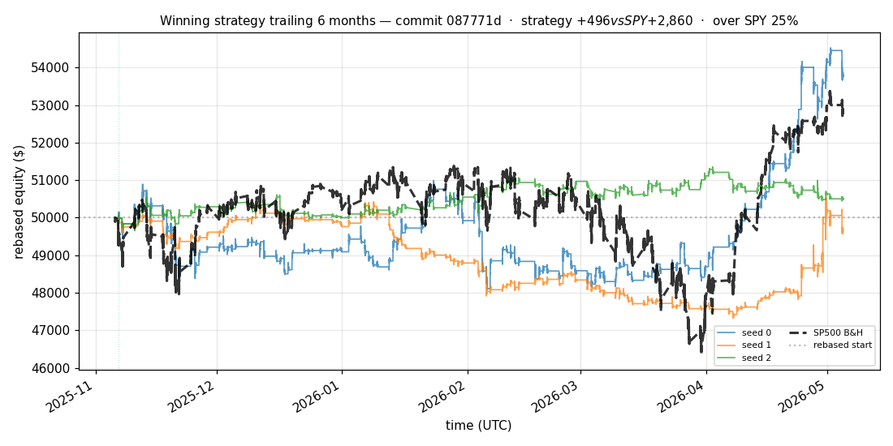

# iter 180 — 087771d

**🔴 DISCARD** · exp180: 180d top2 with 65pct reserve

_2026-05-05 07:07 UTC · 688s wall_

## Result

| metric | value |
|---|---|
| Sharpe (median) | **+0.369** |
| Sharpe CI low (5%) | -1.308 |
| Sharpe CI high (95%) | +2.309 |
| % time above SPY | 42.803% |
| Net PnL | **$+496.48** (+0.993%) |
| Max drawdown | -6.14% |
| Trades | 1 |
| Fees | $1.00 |
| Seeds completed | 3 |

**Decision reason:** objective=-1.1697 ≤ prior best +0.0000 (ci_low=-1.3080, over_spy=42.8%, pnl=+0.99%)

## Data Freshness

| metric | value |
|---|---|
| REFRESH_DATA used | no |
| Symbols loaded per seed | 95–95 |
| Earliest latest bar | 2026-01-13 20:59:00+00:00 |
| Latest latest bar | 2026-05-04 20:49:00+00:00 |

## Winning strategy

Canonical strategy for this iteration: **top4 cross-sectional picker** — rank symbols by the transformer's 4h + 1d forecast Sharpe, buy the top four once enough symbols are ready, hold through the eval window, and keep 1 median trades after costs.

A **seed** is one independent training/evaluation run with a different random initialization and sampling path. The gate uses median/worst-tail statistics across seeds so one lucky seed cannot define the best checkpoint.

Positive seed transaction tables are shown later in this report; losing or flat seed transaction tables are omitted to keep reports focused on actionable winners.

## Per-seed details

```
[evaluator] seed 0: sharpe=+1.208  dd=-5.67%  pnl=$+3,757.89  trades=1
[evaluator] seed 1: sharpe=-0.156  dd=-6.14%  pnl=$-373.25  trades=1
[evaluator] seed 2: sharpe=+0.369  dd=-1.75%  pnl=$+496.48  trades=1
```

## Equity curve (full eval window, ~73 days)



## Equity curve (first month)



## Strategy comparison (equity curves)

Overlays every profile (intraday/intraweek/intramonth/longterm + 
daily-capped/weekly-capped/monthly-capped trade-frequency variants 
+ topN pickers + SPY benchmark) on one chart, using the median-seed run.



## Recent live-style simulations vs SP500

Each chart rebases the winning strategy and SP500 to $50,000 at the start of the trailing window, ending at the latest available bar.

### Trailing 1 day



### Trailing 1 week



### Trailing 1 month



### Trailing 3 months



### Trailing 6 months



## Trader profile comparison

Same trained model, different time-horizon strategies + SPY benchmark + passive top-N pickers.

| profile | sharpe | PnL ($) | PnL % | trades | DD % | horizon |
|---|---:|---:|---:|---:|---:|---:|
| **daily_capped** | -1.415 | $-15.97 | -0.03% | 2 | -0.04% | 1d |
| **intraday** | -12.965 | $-16,098.87 | -32.20% | 5210 | -32.20% | 2h |
| **intramonth** | -0.646 | $-36.98 | -0.07% | 2 | -0.13% | 30d |
| **intraweek** | -5.871 | $-8,115.34 | -16.23% | 2167 | -16.97% | 5d |
| **longterm** | +0.000 | $+0.00 | +0.00% | 2 | -0.13% | 30d |
| **monthly_capped** | +0.000 | $+0.00 | +0.00% | 0 | +0.00% | 30d |
| **spy_buyhold** | +0.767 | $+963.26 | +1.93% | 1 | -3.48% | - |
| **top10_picker** | +0.684 | $+1,086.08 | +2.17% | 9 | -6.31% | - |
| **top1_picker** | +0.000 | $+0.00 | +0.00% | 1 | -4.52% | - |
| **top20_picker** | +0.649 | $+852.85 | +1.71% | 19 | -4.45% | - |
| **top3_picker** | +0.231 | $+585.01 | +1.17% | 2 | -9.81% | - |
| **top4_picker** | +0.572 | $+1,081.66 | +2.16% | 3 | -6.04% | - |
| **top5_picker** | +0.746 | $+1,095.98 | +2.19% | 4 | -7.30% | - |
| **weekly_capped** | -0.641 | $-1,185.61 | -2.37% | 187 | -5.05% | 5d |

**Best active strategy: `top5_picker` (sharpe +0.746) — LOSES TO SPY**

## Out-of-symbol holdout eval

Tested on **JPM, WMT, V, DIS, JNJ** — large-caps the model NEVER saw during training.

| seed | sharpe | PnL | trades | DD% |
|---:|---:|---:|---:|---:|
| 0 | +1.606 | $+2,133.82 | 7 | -3.37% |
| 1 | +1.610 | $+2,141.03 | 9 | -3.38% |
| 2 | +1.664 | $+2,309.19 | 5 | -3.59% |
| 3 | +0.327 | $+504.54 | 5 | -9.19% |
| 4 | +0.000 | $+0.00 | 0 | +0.00% |

**Median holdout sharpe: +1.606** (vs in-symbol +0.369)

## Transactions

_(no profitable per-seed transaction table; losing/flat seeds omitted)_

## Diff vs previous experiment

```diff
087771d exp180: 180d top2 with 65pct reserve


 experiment.py | 8 ++++----
 1 file changed, 4 insertions(+), 4 deletions(-)
```

---

[← all iterations](.) · [back to README](../README.md)
