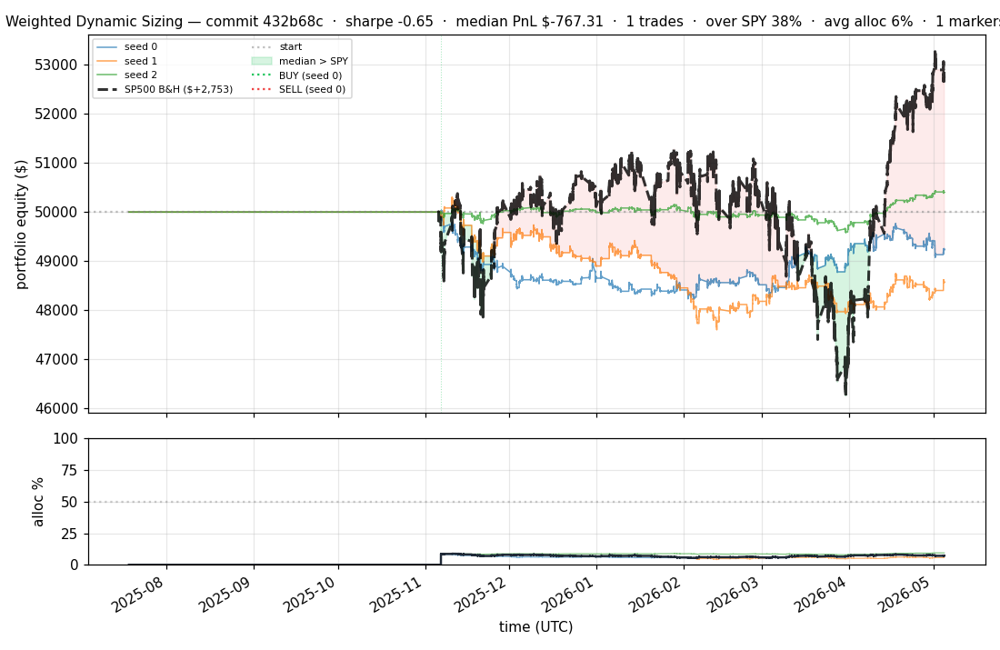
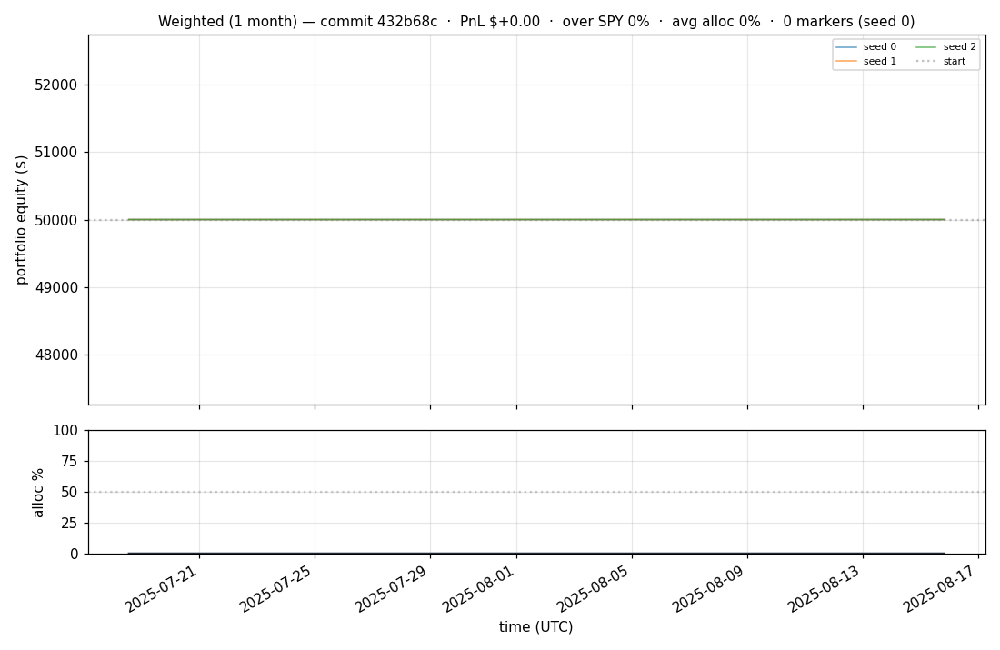
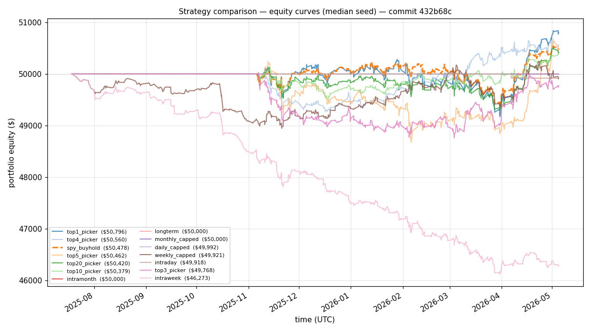
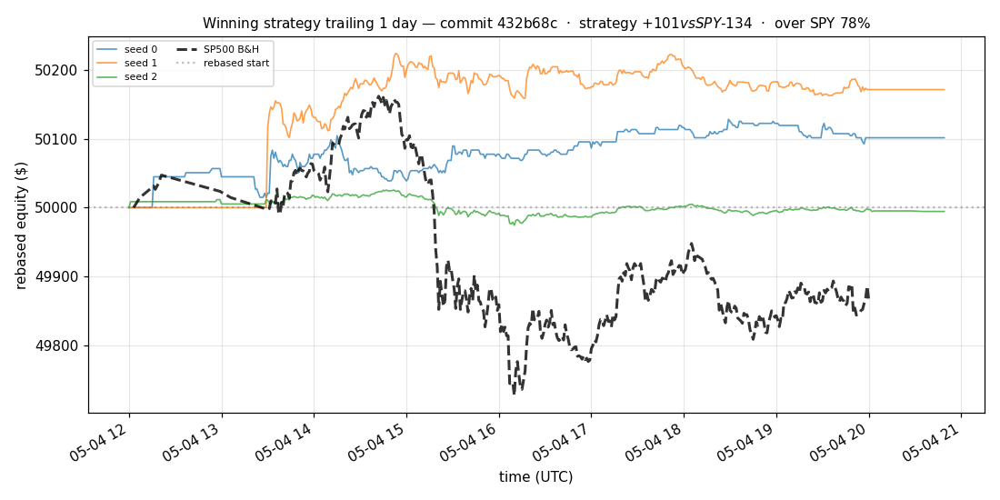
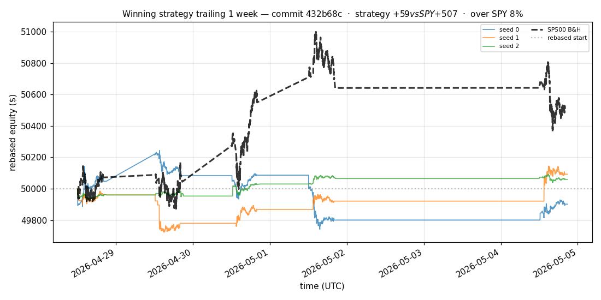
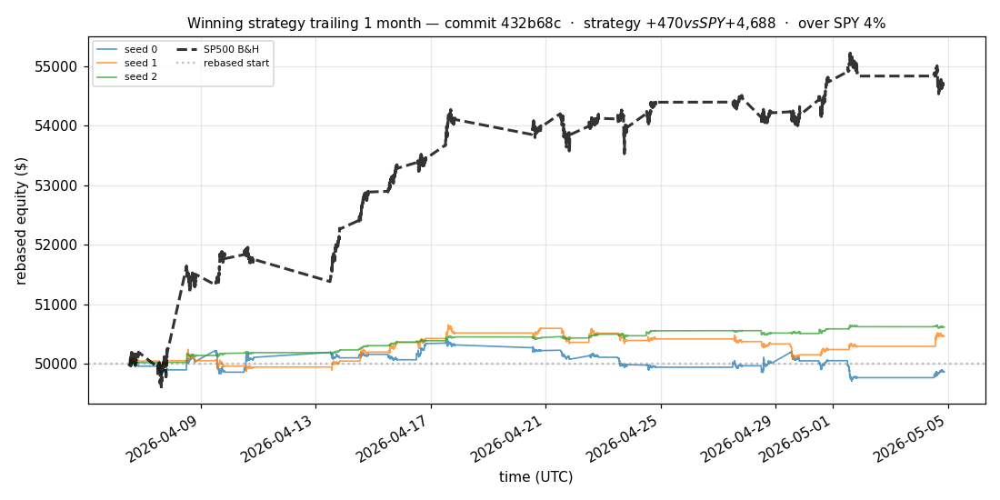
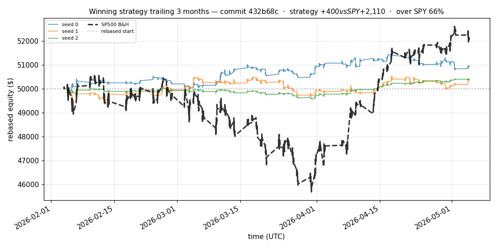
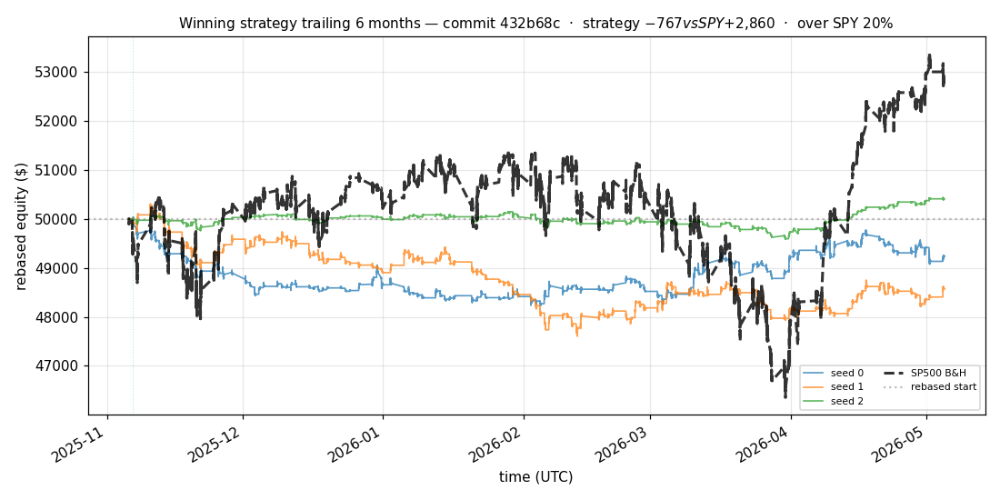

# iter 181 — 432b68c

**🔴 DISCARD** · exp181: 180d top2 long horizon blend

_2026-05-05 07:19 UTC · 698s wall_

## Result

| metric | value |
|---|---|
| Sharpe (median) | **-0.646** |
| Sharpe CI low (5%) | -2.571 |
| Sharpe CI high (95%) | +1.229 |
| % time above SPY | 38.321% |
| Net PnL | **$-767.31** (-1.535%) |
| Max drawdown | -5.37% |
| Trades | 1 |
| Fees | $1.00 |
| Seeds completed | 3 |

**Decision reason:** objective=-2.4714 ≤ prior best +0.0000 (ci_low=-2.5710, over_spy=38.3%, pnl=-1.53%)

## Data Freshness

| metric | value |
|---|---|
| REFRESH_DATA used | no |
| Symbols loaded per seed | 95–95 |
| Earliest latest bar | 2026-01-13 20:59:00+00:00 |
| Latest latest bar | 2026-05-04 20:49:00+00:00 |

## Winning strategy

Canonical strategy for this iteration: **top4 cross-sectional picker** — rank symbols by the transformer's 4h + 1d forecast Sharpe, buy the top four once enough symbols are ready, hold through the eval window, and keep 1 median trades after costs.

A **seed** is one independent training/evaluation run with a different random initialization and sampling path. The gate uses median/worst-tail statistics across seeds so one lucky seed cannot define the best checkpoint.

Positive seed transaction tables are shown later in this report; losing or flat seed transaction tables are omitted to keep reports focused on actionable winners.

## Per-seed details

```
[evaluator] seed 0: sharpe=-0.646  dd=-3.61%  pnl=$-767.31  trades=1
[evaluator] seed 1: sharpe=-1.099  dd=-5.37%  pnl=$-1,429.71  trades=1
[evaluator] seed 2: sharpe=+0.780  dd=-1.13%  pnl=$+403.70  trades=1
```

## Equity curve (full eval window, ~73 days)



## Equity curve (first month)



## Strategy comparison (equity curves)

Overlays every profile (intraday/intraweek/intramonth/longterm + 
daily-capped/weekly-capped/monthly-capped trade-frequency variants 
+ topN pickers + SPY benchmark) on one chart, using the median-seed run.



## Recent live-style simulations vs SP500

Each chart rebases the winning strategy and SP500 to $50,000 at the start of the trailing window, ending at the latest available bar.

### Trailing 1 day



### Trailing 1 week



### Trailing 1 month



### Trailing 3 months



### Trailing 6 months



## Trader profile comparison

Same trained model, different time-horizon strategies + SPY benchmark + passive top-N pickers.

| profile | sharpe | PnL ($) | PnL % | trades | DD % | horizon |
|---|---:|---:|---:|---:|---:|---:|
| **daily_capped** | -1.583 | $-7.51 | -0.02% | 2 | -0.02% | 1d |
| **intraday** | -12.965 | $-7,854.26 | -15.71% | 5195 | -15.71% | 2h |
| **intramonth** | -0.324 | $-8.55 | -0.02% | 2 | -0.06% | 30d |
| **intraweek** | -5.670 | $-4,037.03 | -8.07% | 1402 | -8.21% | 5d |
| **longterm** | +0.000 | $+0.00 | +0.00% | 2 | -0.06% | 30d |
| **monthly_capped** | +0.000 | $+0.00 | +0.00% | 0 | +0.00% | 30d |
| **spy_buyhold** | +0.759 | $+477.27 | +0.95% | 1 | -1.73% | - |
| **top10_picker** | +0.687 | $+543.82 | +1.09% | 9 | -3.14% | - |
| **top1_picker** | +0.000 | $+0.00 | +0.00% | 1 | -2.26% | - |
| **top20_picker** | +0.641 | $+528.48 | +1.06% | 19 | -2.21% | - |
| **top3_picker** | +0.224 | $+304.83 | +0.61% | 2 | -4.91% | - |
| **top4_picker** | +0.584 | $+559.98 | +1.12% | 3 | -3.01% | - |
| **top5_picker** | +0.760 | $+560.29 | +1.12% | 4 | -3.64% | - |
| **weekly_capped** | -0.083 | $-78.51 | -0.16% | 140 | -2.15% | 5d |

**Best active strategy: `top5_picker` (sharpe +0.760) — BEATS SPY ✓**

## Out-of-symbol holdout eval

Tested on **JPM, WMT, V, DIS, JNJ** — large-caps the model NEVER saw during training.

| seed | sharpe | PnL | trades | DD% |
|---:|---:|---:|---:|---:|
| 0 | +1.651 | $+1,100.02 | 7 | -1.72% |
| 1 | +1.649 | $+1,099.13 | 9 | -1.72% |
| 2 | +1.664 | $+1,158.26 | 5 | -1.83% |
| 3 | +0.327 | $+504.54 | 5 | -9.19% |
| 4 | +0.000 | $+0.00 | 0 | +0.00% |

**Median holdout sharpe: +1.649** (vs in-symbol -0.646)

## Transactions

_(no profitable per-seed transaction table; losing/flat seeds omitted)_

## Diff vs previous experiment

```diff
432b68c exp181: 180d top2 long horizon blend


 experiment.py | 6 +++---
 1 file changed, 3 insertions(+), 3 deletions(-)
```

---

[← all iterations](.) · [back to README](../README.md)
