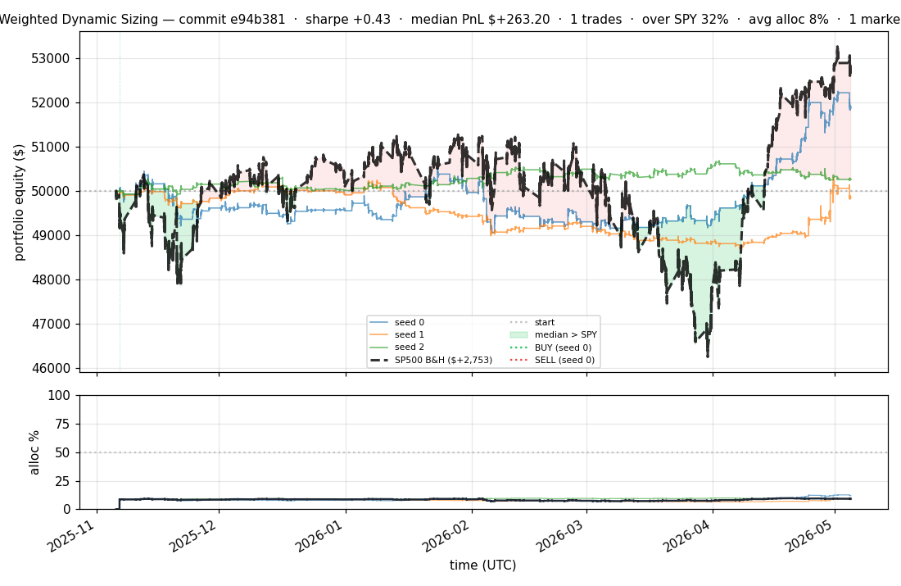
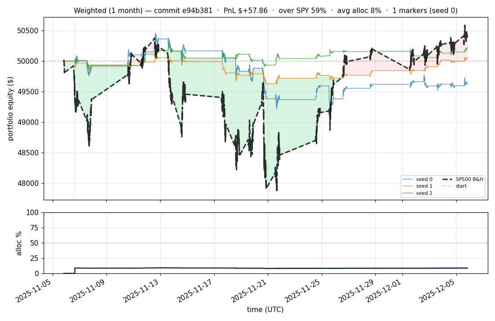
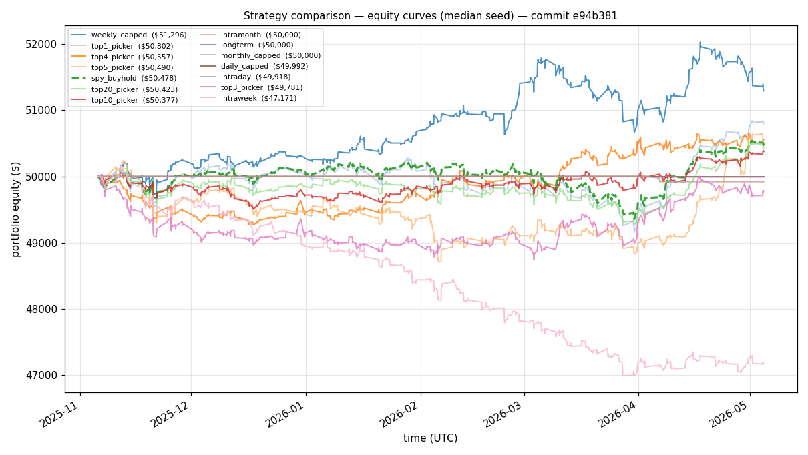
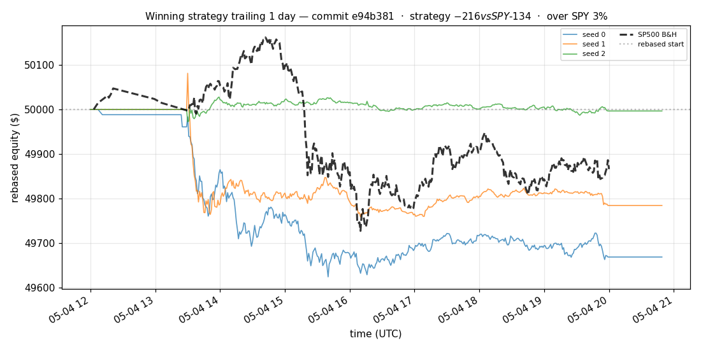
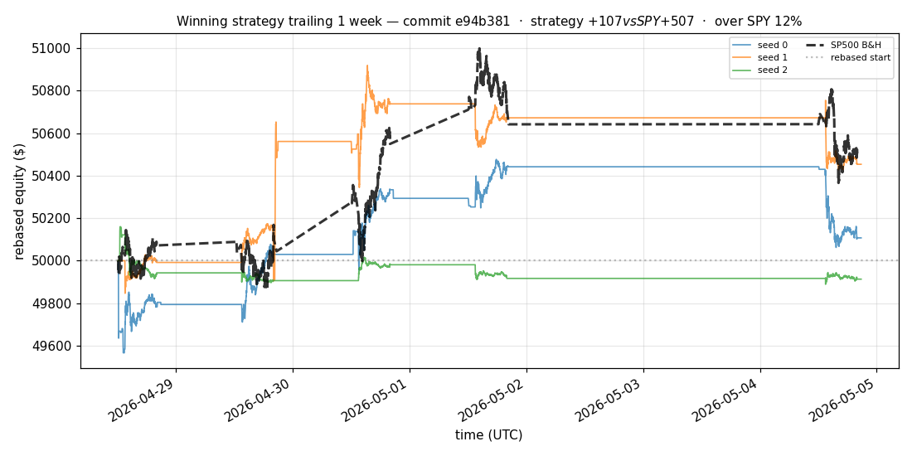
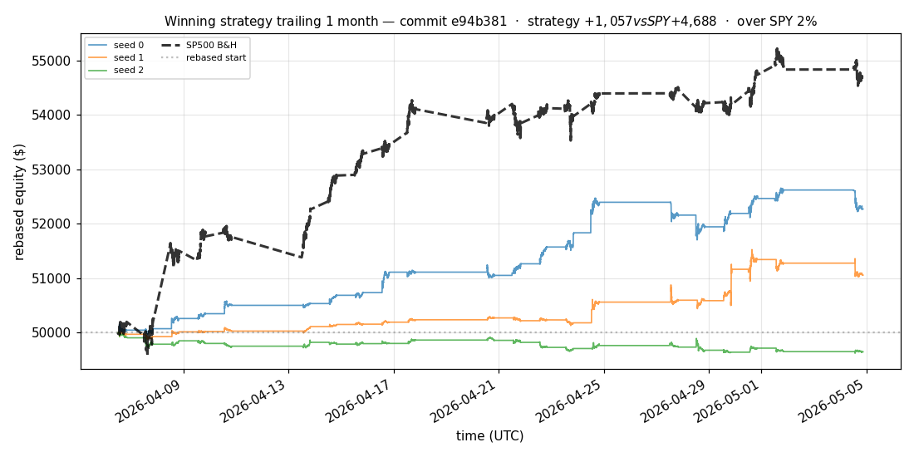
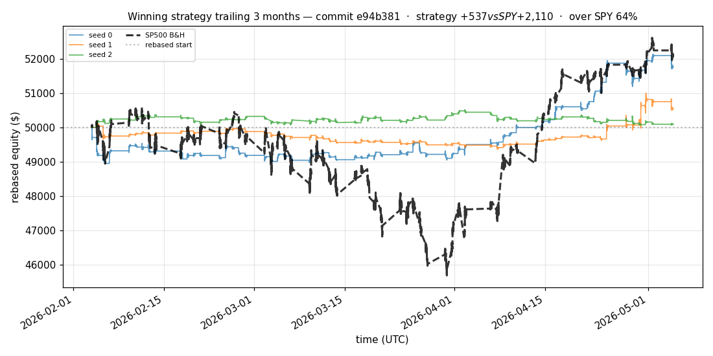
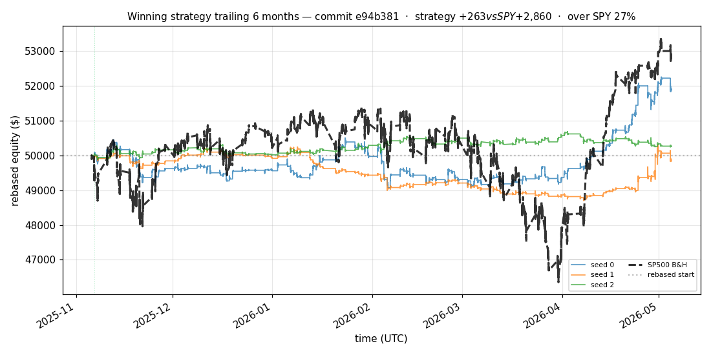

# iter 183 — e94b381

**🔴 DISCARD** · exp183: 180d filter stale symbols

_2026-05-05 07:44 UTC · 695s wall_

## Result

| metric | value |
|---|---|
| Sharpe (median) | **+0.430** |
| Sharpe CI low (5%) | -1.738 |
| Sharpe CI high (95%) | +2.468 |
| % time above SPY | 31.590% |
| Net PnL | **$+263.20** (+0.526%) |
| Max drawdown | -3.08% |
| Trades | 1 |
| Fees | $1.00 |
| Seeds completed | 3 |

**Decision reason:** objective=-1.6380 ≤ prior best +0.0000 (ci_low=-1.7380, over_spy=31.6%, pnl=+0.53%)

## Data Freshness

| metric | value |
|---|---|
| REFRESH_DATA used | no |
| Symbols loaded per seed | 94–94 |
| Earliest latest bar | 2026-05-04 19:59:00+00:00 |
| Latest latest bar | 2026-05-04 20:49:00+00:00 |

## Winning strategy

Canonical strategy for this iteration: **top4 cross-sectional picker** — rank symbols by the transformer's 4h + 1d forecast Sharpe, buy the top four once enough symbols are ready, hold through the eval window, and keep 1 median trades after costs.

A **seed** is one independent training/evaluation run with a different random initialization and sampling path. The gate uses median/worst-tail statistics across seeds so one lucky seed cannot define the best checkpoint.

Positive seed transaction tables are shown later in this report; losing or flat seed transaction tables are omitted to keep reports focused on actionable winners.

## Per-seed details

```
[evaluator] seed 0: sharpe=+1.364  dd=-2.84%  pnl=$+1,876.18  trades=1
[evaluator] seed 1: sharpe=-0.155  dd=-3.08%  pnl=$-151.96  trades=1
[evaluator] seed 2: sharpe=+0.430  dd=-0.88%  pnl=$+263.20  trades=1
```

## Equity curve (full eval window, ~73 days)



## Equity curve (first month)



## Strategy comparison (equity curves)

Overlays every profile (intraday/intraweek/intramonth/longterm + 
daily-capped/weekly-capped/monthly-capped trade-frequency variants 
+ topN pickers + SPY benchmark) on one chart, using the median-seed run.



## Recent live-style simulations vs SP500

Each chart rebases the winning strategy and SP500 to $50,000 at the start of the trailing window, ending at the latest available bar.

### Trailing 1 day



### Trailing 1 week



### Trailing 1 month



### Trailing 3 months



### Trailing 6 months



## Trader profile comparison

Same trained model, different time-horizon strategies + SPY benchmark + passive top-N pickers.

| profile | sharpe | PnL ($) | PnL % | trades | DD % | horizon |
|---|---:|---:|---:|---:|---:|---:|
| **daily_capped** | -1.781 | $-7.51 | -0.02% | 2 | -0.02% | 1d |
| **intraday** | -12.965 | $-7,694.49 | -15.39% | 5210 | -15.40% | 2h |
| **intramonth** | -0.365 | $-8.55 | -0.02% | 2 | -0.06% | 30d |
| **intraweek** | -5.377 | $-3,245.82 | -6.49% | 1346 | -7.20% | 5d |
| **longterm** | +0.000 | $+0.00 | +0.00% | 2 | -0.06% | 30d |
| **monthly_capped** | +0.000 | $+0.00 | +0.00% | 0 | +0.00% | 30d |
| **spy_buyhold** | +0.759 | $+477.27 | +0.95% | 1 | -1.73% | - |
| **top10_picker** | +0.773 | $+543.82 | +1.09% | 9 | -3.14% | - |
| **top1_picker** | +0.000 | $+0.00 | +0.00% | 1 | -2.26% | - |
| **top20_picker** | +0.721 | $+528.48 | +1.06% | 19 | -2.21% | - |
| **top3_picker** | +0.252 | $+304.83 | +0.61% | 2 | -4.91% | - |
| **top4_picker** | +0.657 | $+559.98 | +1.12% | 3 | -3.01% | - |
| **top5_picker** | +0.855 | $+560.29 | +1.12% | 4 | -3.64% | - |
| **weekly_capped** | +1.471 | $+1,309.07 | +2.62% | 125 | -2.27% | 5d |

**Best active strategy: `weekly_capped` (sharpe +1.471) — BEATS SPY ✓**

## Out-of-symbol holdout eval

Tested on **JPM, WMT, V, DIS, JNJ** — large-caps the model NEVER saw during training.

| seed | sharpe | PnL | trades | DD% |
|---:|---:|---:|---:|---:|
| 0 | +1.651 | $+1,100.02 | 7 | -1.72% |
| 1 | +1.649 | $+1,099.13 | 9 | -1.72% |
| 2 | +1.664 | $+1,158.26 | 5 | -1.83% |
| 3 | +0.327 | $+504.54 | 5 | -9.19% |
| 4 | +0.000 | $+0.00 | 0 | +0.00% |

**Median holdout sharpe: +1.649** (vs in-symbol +0.430)

## Transactions

_(no profitable per-seed transaction table; losing/flat seeds omitted)_

## Diff vs previous experiment

```diff
e94b381 exp183: 180d filter stale symbols


 experiment.py | 26 ++++++++++++++++++++++----
 1 file changed, 22 insertions(+), 4 deletions(-)
```

---

[← all iterations](.) · [back to README](../README.md)
