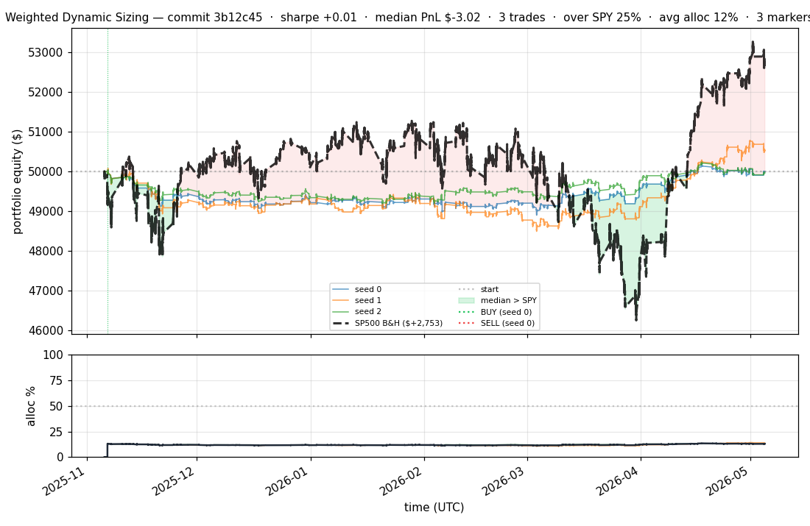
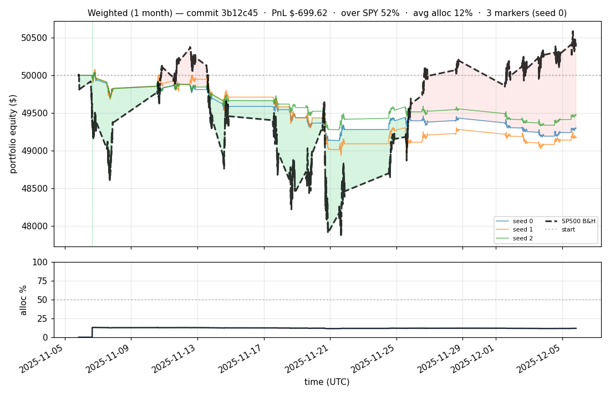
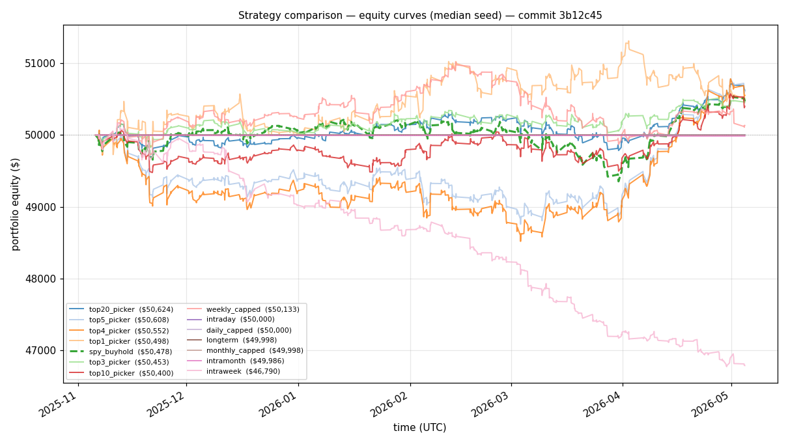
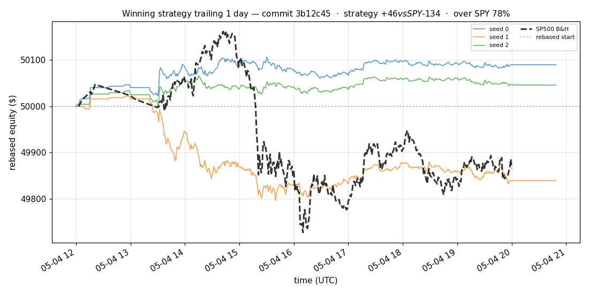
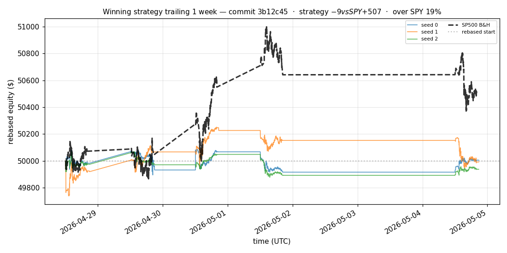
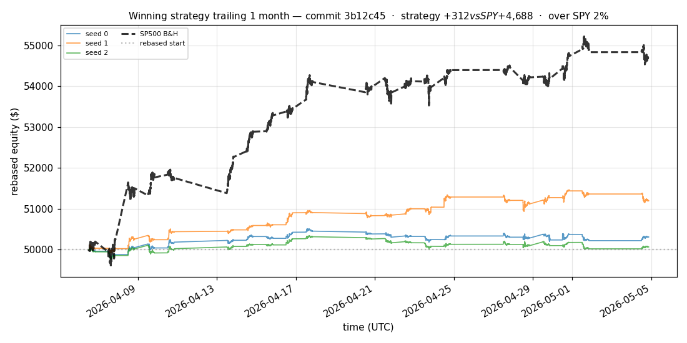
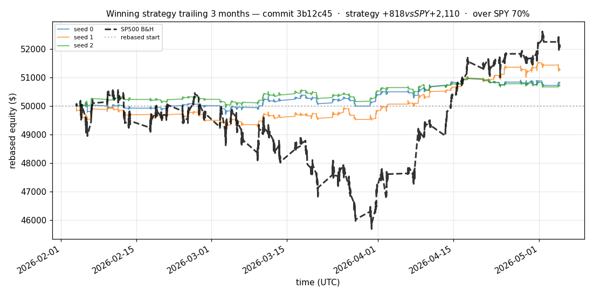
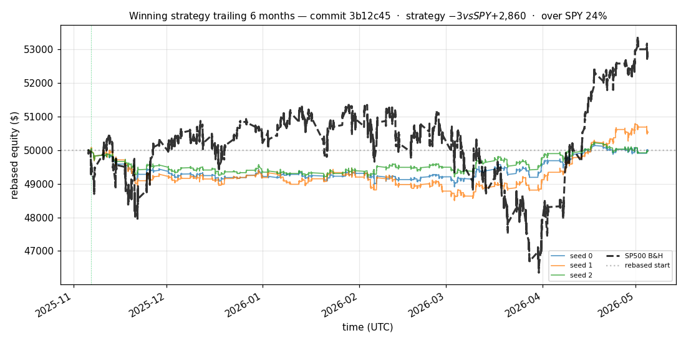

# iter 186 — 3b12c45

**🔴 DISCARD** · exp186: fresh 2 epoch pretrain with async refresh

_2026-05-05 12:42 UTC · 14218s wall_

## Result

| metric | value |
|---|---|
| Sharpe (median) | **+0.009** |
| Sharpe CI low (5%) | -2.097 |
| Sharpe CI high (95%) | +1.912 |
| % time above SPY | 24.824% |
| Net PnL | **$-3.02** (-0.006%) |
| Max drawdown | -3.16% |
| Trades | 3 |
| Fees | $3.00 |
| Seeds completed | 3 |

**Decision reason:** objective=-2.0226 ≤ prior best +0.0000 (ci_low=-2.0970, over_spy=24.8%, pnl=-0.01%)

## Data Freshness

| metric | value |
|---|---|
| REFRESH_DATA used | no |
| Symbols loaded per seed | 94–94 |
| Earliest latest bar | 2026-05-04 19:59:00+00:00 |
| Latest latest bar | 2026-05-04 20:49:00+00:00 |

## Winning strategy

Canonical strategy for this iteration: **top4 cross-sectional picker** — rank symbols by the transformer's 4h + 1d forecast Sharpe, buy the top four once enough symbols are ready, hold through the eval window, and keep 3 median trades after costs.

A **seed** is one independent training/evaluation run with a different random initialization and sampling path. The gate uses median/worst-tail statistics across seeds so one lucky seed cannot define the best checkpoint.

Positive seed transaction tables are shown later in this report; losing or flat seed transaction tables are omitted to keep reports focused on actionable winners.

## Per-seed details

```
[evaluator] seed 0: sharpe=+0.009  dd=-2.26%  pnl=$-3.02  trades=3
[evaluator] seed 1: sharpe=+0.540  dd=-3.16%  pnl=$+524.59  trades=3
[evaluator] seed 2: sharpe=-0.039  dd=-1.69%  pnl=$-34.92  trades=3
```

## Equity curve (full eval window, ~73 days)



## Equity curve (first month)



## Strategy comparison (equity curves)

Overlays every profile (intraday/intraweek/intramonth/longterm + 
daily-capped/weekly-capped/monthly-capped trade-frequency variants 
+ topN pickers + SPY benchmark) on one chart, using the median-seed run.



## Recent live-style simulations vs SP500

Each chart rebases the winning strategy and SP500 to $50,000 at the start of the trailing window, ending at the latest available bar.

### Trailing 1 day



### Trailing 1 week



### Trailing 1 month



### Trailing 3 months



### Trailing 6 months



## Trader profile comparison

Same trained model, different time-horizon strategies + SPY benchmark + passive top-N pickers.

| profile | sharpe | PnL ($) | PnL % | trades | DD % | horizon |
|---|---:|---:|---:|---:|---:|---:|
| **daily_capped** | +0.000 | $+0.00 | +0.00% | 0 | +0.00% | 1d |
| **intraday** | -12.965 | $-7,977.47 | -15.95% | 5123 | -15.99% | 2h |
| **intramonth** | -1.805 | $-282.74 | -0.57% | 10 | -0.57% | 30d |
| **intraweek** | -6.307 | $-3,973.57 | -7.95% | 1381 | -8.28% | 5d |
| **longterm** | -1.805 | $-2.44 | -0.00% | 10 | -0.57% | 30d |
| **monthly_capped** | -1.805 | $-2.44 | -0.00% | 10 | -0.03% | 30d |
| **spy_buyhold** | +0.759 | $+477.27 | +0.95% | 1 | -1.73% | - |
| **top10_picker** | +1.244 | $+894.37 | +1.79% | 9 | -1.44% | - |
| **top1_picker** | +0.000 | $+0.00 | +0.00% | 1 | -1.74% | - |
| **top20_picker** | +1.220 | $+636.26 | +1.27% | 19 | -1.09% | - |
| **top3_picker** | +0.851 | $+491.78 | +0.98% | 2 | -2.92% | - |
| **top4_picker** | +0.618 | $+524.59 | +1.05% | 3 | -0.99% | - |
| **top5_picker** | +1.455 | $+826.99 | +1.65% | 4 | -2.67% | - |
| **weekly_capped** | +0.179 | $+113.72 | +0.23% | 141 | -2.20% | 5d |

**Best active strategy: `top5_picker` (sharpe +1.455) — BEATS SPY ✓**

## Out-of-symbol holdout eval

Tested on **JPM, WMT, V, DIS, JNJ** — large-caps the model NEVER saw during training.

| seed | sharpe | PnL | trades | DD% |
|---:|---:|---:|---:|---:|
| 0 | +0.000 | $+0.00 | 0 | +0.00% |
| 1 | +1.639 | $+1,131.65 | 7 | -1.80% |
| 2 | +0.000 | $+0.00 | 0 | +0.00% |
| 3 | +0.327 | $+504.54 | 5 | -9.19% |
| 4 | +0.000 | $+0.00 | 0 | +0.00% |

**Median holdout sharpe: +0.000** (vs in-symbol +0.009)

## Transactions

_(no profitable per-seed transaction table; losing/flat seeds omitted)_

## Diff vs previous experiment

```diff
3b12c45 exp186: refresh data asynchronously during training


 autoresearch_driver.py | 26 +++++++++++++++++++-------
 1 file changed, 19 insertions(+), 7 deletions(-)
```

---

[← all iterations](.) · [back to README](../README.md)
