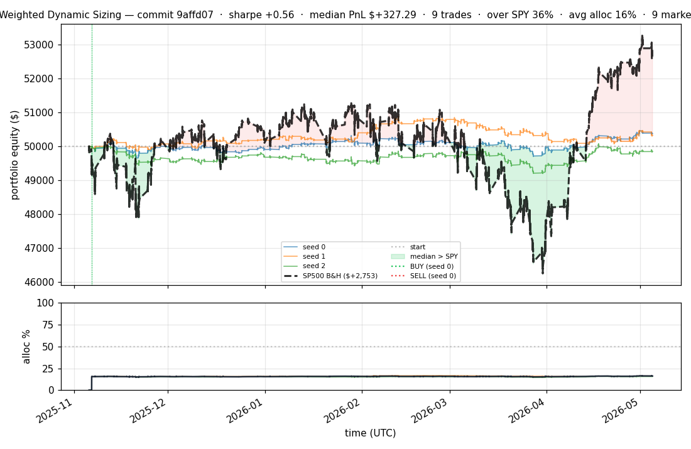
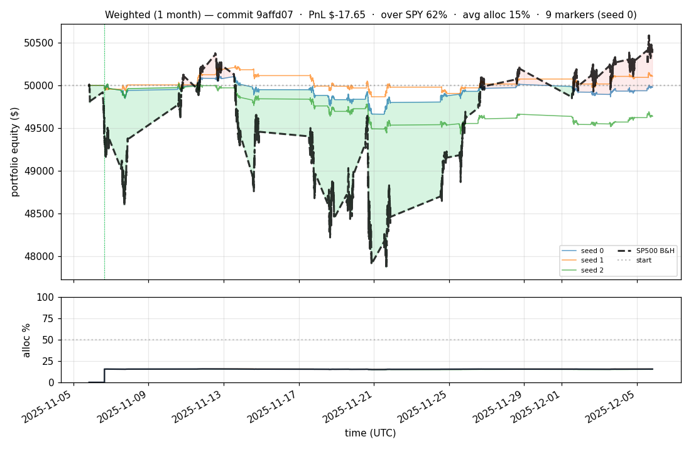
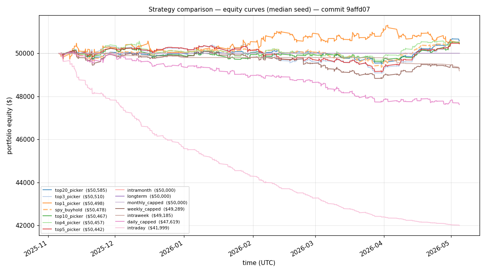
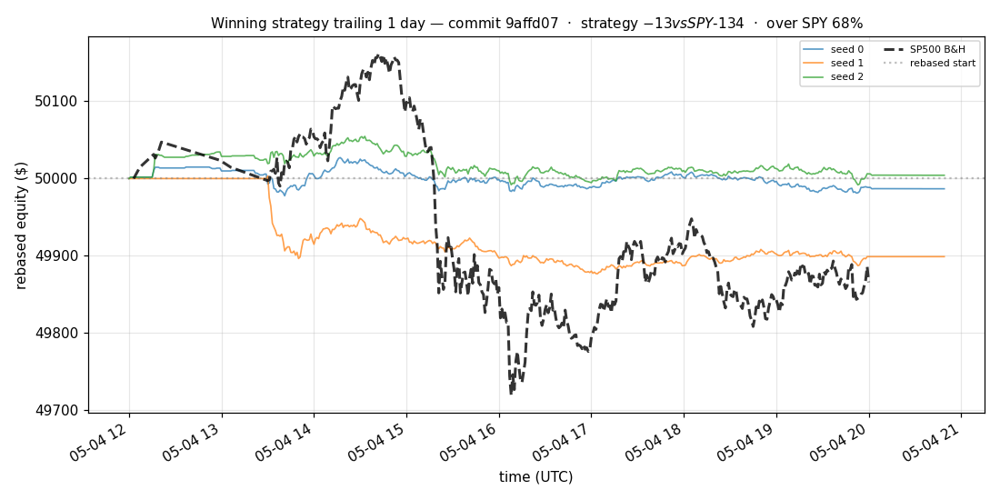
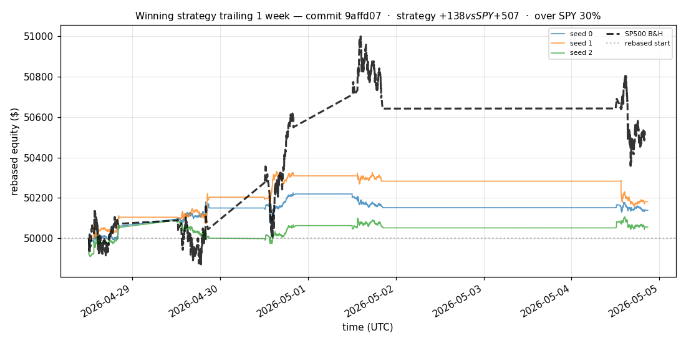
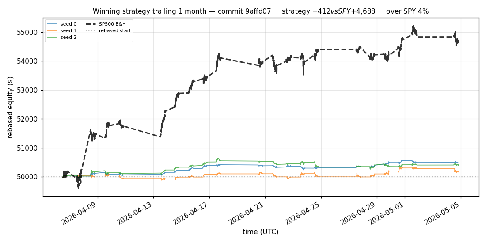
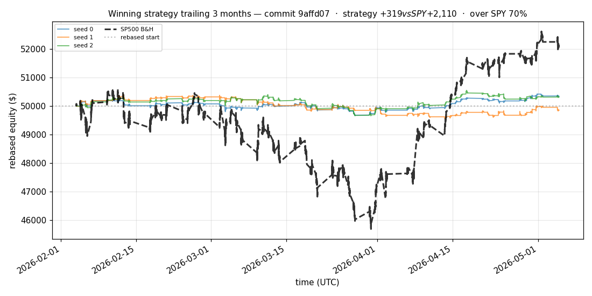
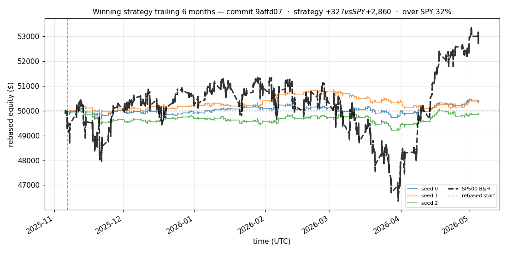

# iter 188 — 9affd07

**🔴 DISCARD** · exp188: calendar top10 cached canonical

_2026-05-05 16:33 UTC · 741s wall_

## Result

| metric | value |
|---|---|
| Sharpe (median) | **+0.565** |
| Sharpe CI low (5%) | -1.558 |
| Sharpe CI high (95%) | +2.396 |
| % time above SPY | 36.319% |
| Net PnL | **$+327.29** (+0.655%) |
| Max drawdown | -1.66% |
| Trades | 9 |
| Fees | $9.00 |
| Seeds completed | 3 |

**Decision reason:** objective=-1.4425 ≤ prior best +0.0000 (ci_low=-1.5580, over_spy=36.3%, pnl=+0.66%)

## Data Freshness

| metric | value |
|---|---|
| REFRESH_DATA used | no |
| Symbols loaded per seed | 94–94 |
| Earliest latest bar | 2026-05-04 19:59:00+00:00 |
| Latest latest bar | 2026-05-04 20:49:00+00:00 |

## Winning strategy

Canonical strategy for this iteration: **top4 cross-sectional picker** — rank symbols by the transformer's 4h + 1d forecast Sharpe, buy the top four once enough symbols are ready, hold through the eval window, and keep 9 median trades after costs.

A **seed** is one independent training/evaluation run with a different random initialization and sampling path. The gate uses median/worst-tail statistics across seeds so one lucky seed cannot define the best checkpoint.

Positive seed transaction tables are shown later in this report; losing or flat seed transaction tables are omitted to keep reports focused on actionable winners.

## Per-seed details

```
[evaluator] seed 0: sharpe=+0.659  dd=-1.23%  pnl=$+378.93  trades=9
[evaluator] seed 1: sharpe=+0.565  dd=-1.66%  pnl=$+327.29  trades=9
[evaluator] seed 2: sharpe=-0.244  dd=-1.64%  pnl=$-146.65  trades=9
```

## Equity curve (full eval window, ~73 days)



## Equity curve (first month)



## Strategy comparison (equity curves)

Overlays every profile (intraday/intraweek/intramonth/longterm + 
daily-capped/weekly-capped/monthly-capped trade-frequency variants 
+ topN pickers + SPY benchmark) on one chart, using the median-seed run.



## Recent live-style simulations vs SP500

Each chart rebases the winning strategy and SP500 to $50,000 at the start of the trailing window, ending at the latest available bar.

### Trailing 1 day



### Trailing 1 week



### Trailing 1 month



### Trailing 3 months



### Trailing 6 months



## Trader profile comparison

Same trained model, different time-horizon strategies + SPY benchmark + passive top-N pickers.

| profile | sharpe | PnL ($) | PnL % | trades | DD % | horizon |
|---|---:|---:|---:|---:|---:|---:|
| **daily_capped** | -4.929 | $-2,386.40 | -4.77% | 1399 | -4.97% | 1d |
| **intraday** | -22.405 | $-8,029.91 | -16.06% | 4835 | -16.10% | 2h |
| **intramonth** | -1.022 | $-3.91 | -0.01% | 2 | -0.57% | 30d |
| **intraweek** | -7.255 | $-3,171.51 | -6.34% | 981 | -6.51% | 5d |
| **longterm** | +0.000 | $+0.00 | +0.00% | 2 | -0.57% | 30d |
| **monthly_capped** | +0.000 | $+0.00 | +0.00% | 2 | -0.01% | 30d |
| **spy_buyhold** | +0.759 | $+477.27 | +0.95% | 1 | -1.73% | - |
| **top10_picker** | +1.004 | $+547.69 | +1.10% | 9 | -1.35% | - |
| **top1_picker** | +0.000 | $+0.00 | +0.00% | 1 | -1.74% | - |
| **top20_picker** | +1.094 | $+715.27 | +1.43% | 19 | -1.61% | - |
| **top3_picker** | +0.783 | $+661.26 | +1.32% | 2 | -2.75% | - |
| **top4_picker** | +0.668 | $+459.88 | +0.92% | 3 | -1.85% | - |
| **top5_picker** | +1.319 | $+980.40 | +1.96% | 4 | -2.49% | - |
| **weekly_capped** | -1.271 | $-707.68 | -1.42% | 354 | -1.74% | 5d |

**Best active strategy: `top5_picker` (sharpe +1.319) — BEATS SPY ✓**

## Out-of-symbol holdout eval

Tested on **JPM, WMT, V, DIS, JNJ** — large-caps the model NEVER saw during training.

| seed | sharpe | PnL | trades | DD% |
|---:|---:|---:|---:|---:|
| 0 | +0.000 | $+0.00 | 0 | +0.00% |
| 1 | +0.000 | $+0.00 | 0 | +0.00% |
| 2 | +0.000 | $+0.00 | 0 | +0.00% |
| 3 | +0.327 | $+504.54 | 5 | -9.19% |
| 4 | +0.000 | $+0.00 | 0 | +0.00% |

**Median holdout sharpe: +0.000** (vs in-symbol +0.565)

## Per-symbol summary (profitable seeds only)

| symbol | total trades | buys | sells | avg hold (days) | held-to-end |
|---|---:|---:|---:|---:|---:|
| **NFLX** | 2 | 1 | 1 | 0.0 | 0 |
| **BKNG** | 2 | 1 | 1 | 0.0 | 0 |

## Transactions

### Seed 1 — 4 trades · ending equity $50,000.03 (+0.03 = +0.00%)

| # | timestamp (UTC) | symbol | side |
|---:|---|---|---|
| 1 | 2025-11-17 14:36:00 | NFLX | BUY |
| 2 | 2025-11-17 14:40:00 | NFLX | SELL |
| 3 | 2026-04-06 13:31:00 | BKNG | BUY |
| 4 | 2026-04-06 13:49:00 | BKNG | SELL |

## Diff vs previous experiment

```diff
9affd07 exp188: test calendar top10 canonical


 experiment.py | 9 +++++----
 1 file changed, 5 insertions(+), 4 deletions(-)
```

---

[← all iterations](.) · [back to README](../README.md)
