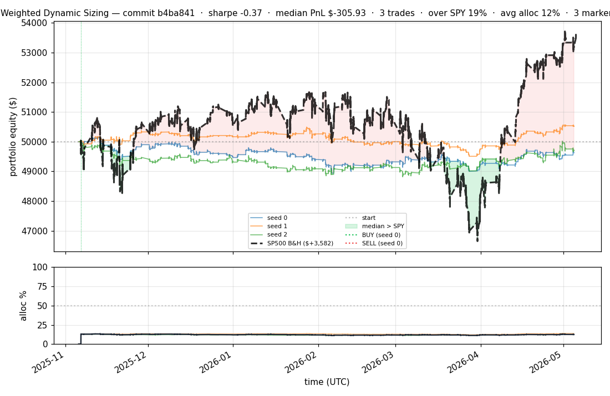
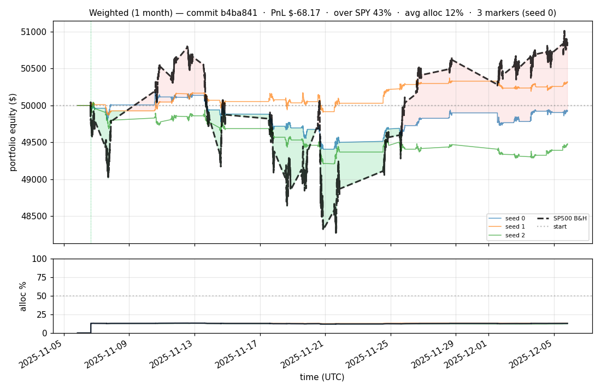
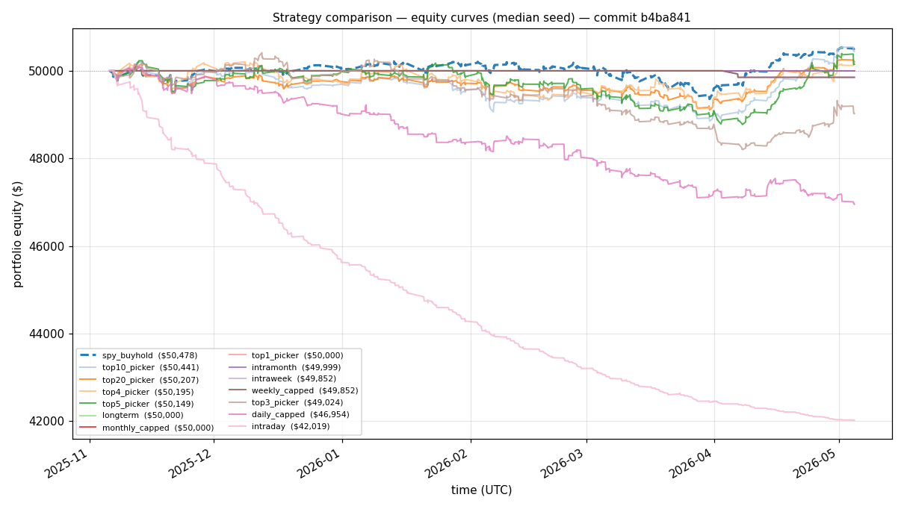
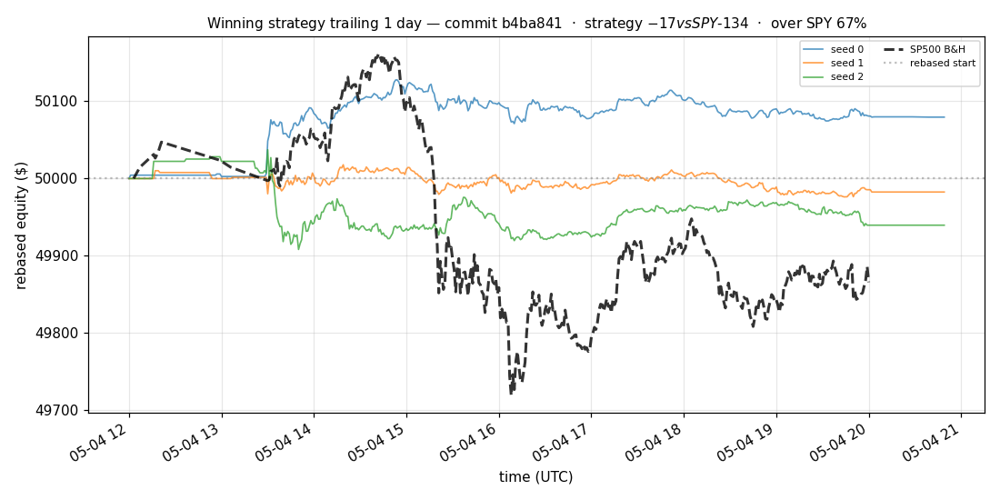
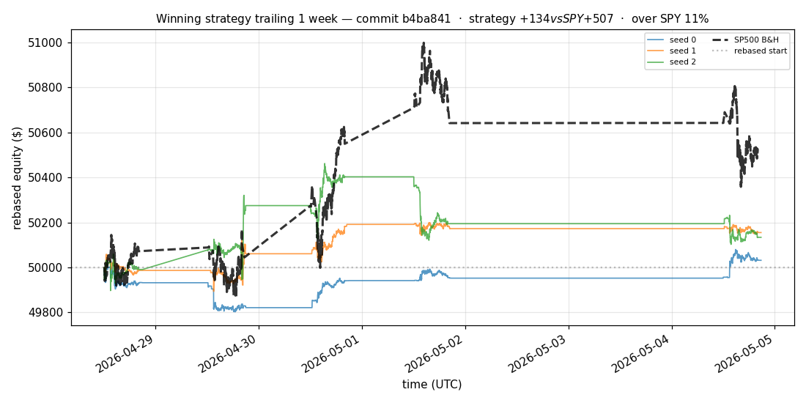
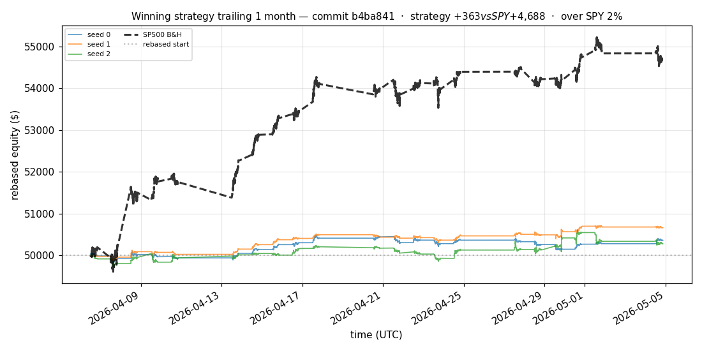
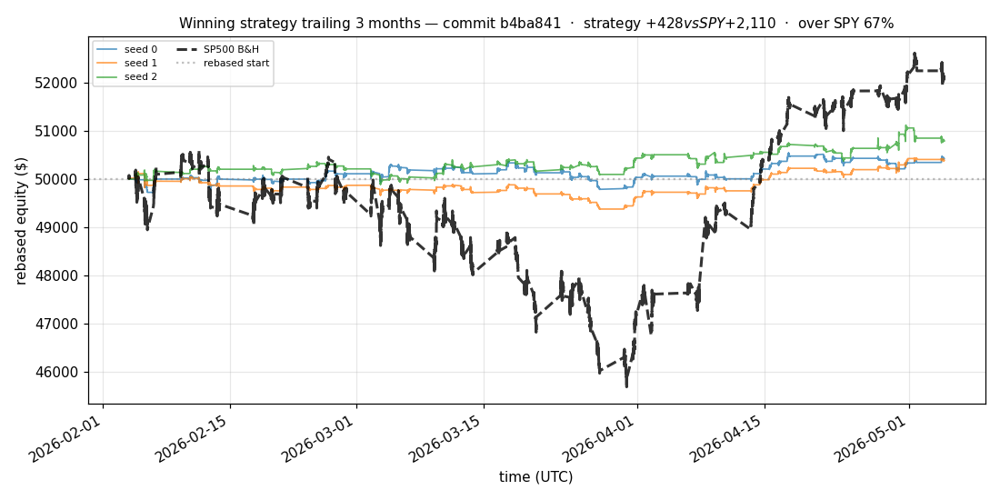
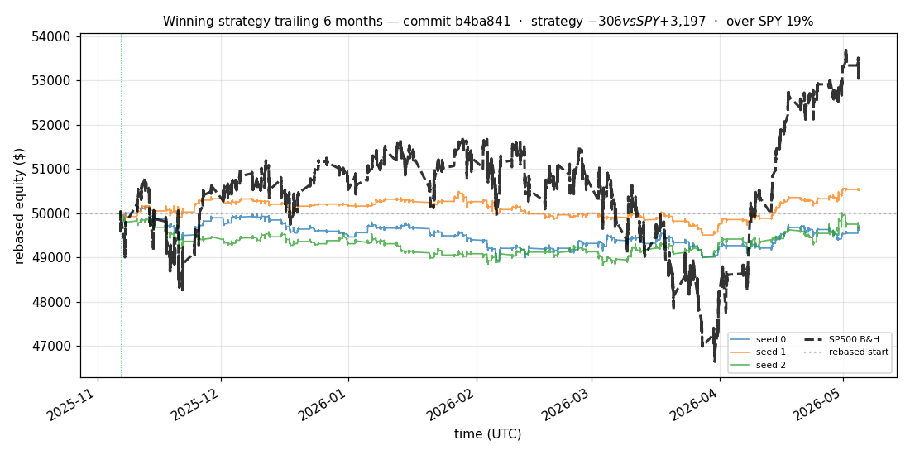

# iter 191 — b4ba841

**🔴 DISCARD** · exp191: SPY trend context fresh train

_2026-05-05 19:40 UTC · 8801s wall_

## Result

| metric | value |
|---|---|
| Sharpe (median) | **-0.373** |
| Sharpe CI low (5%) | -2.580 |
| Sharpe CI high (95%) | +1.339 |
| % time above SPY | 19.195% |
| Net PnL | **$-305.93** (-0.612%) |
| Max drawdown | -2.47% |
| Trades | 3 |
| Fees | $3.00 |
| Seeds completed | 3 |

**Decision reason:** objective=-2.5285 ≤ prior best +0.0000 (ci_low=-2.5800, over_spy=19.2%, pnl=-0.61%)

## Data Freshness

| metric | value |
|---|---|
| REFRESH_DATA used | no |
| Symbols loaded per seed | 94–94 |
| Earliest latest bar | 2026-05-04 19:59:00+00:00 |
| Latest latest bar | 2026-05-04 20:49:00+00:00 |

## Winning strategy

Canonical strategy for this iteration: **top4 cross-sectional picker** — rank symbols by the transformer's 4h + 1d forecast Sharpe, buy the top four once enough symbols are ready, hold through the eval window, and keep 3 median trades after costs.

A **seed** is one independent training/evaluation run with a different random initialization and sampling path. The gate uses median/worst-tail statistics across seeds so one lucky seed cannot define the best checkpoint.

Positive seed transaction tables are shown later in this report; losing or flat seed transaction tables are omitted to keep reports focused on actionable winners.

## Per-seed details

```
[evaluator] seed 0: sharpe=-0.481  dd=-2.47%  pnl=$-371.78  trades=3
[evaluator] seed 1: sharpe=+0.760  dd=-1.96%  pnl=$+521.76  trades=3
[evaluator] seed 2: sharpe=-0.373  dd=-2.46%  pnl=$-305.93  trades=3
```

## Equity curve (full eval window, ~73 days)



## Equity curve (first month)



## Strategy comparison (equity curves)

Overlays every profile (intraday/intraweek/intramonth/longterm + 
daily-capped/weekly-capped/monthly-capped trade-frequency variants 
+ topN pickers + SPY benchmark) on one chart, using the median-seed run.



## Recent live-style simulations vs SP500

Each chart rebases the winning strategy and SP500 to $50,000 at the start of the trailing window, ending at the latest available bar.

### Trailing 1 day



### Trailing 1 week



### Trailing 1 month



### Trailing 3 months



### Trailing 6 months



## Trader profile comparison

Same trained model, different time-horizon strategies + SPY benchmark + passive top-N pickers.

| profile | sharpe | PnL ($) | PnL % | trades | DD % | horizon |
|---|---:|---:|---:|---:|---:|---:|
| **daily_capped** | -4.200 | $-3,056.50 | -6.11% | 1265 | -6.40% | 1d |
| **intraday** | -24.404 | $-7,986.19 | -15.97% | 5363 | -16.02% | 2h |
| **intramonth** | -1.022 | $-282.74 | -0.57% | 4 | -0.57% | 30d |
| **intraweek** | -4.723 | $-5,886.54 | -11.77% | 981 | -11.78% | 5d |
| **longterm** | +0.000 | $+0.00 | +0.00% | 4 | -0.57% | 30d |
| **monthly_capped** | +0.000 | $+0.00 | +0.00% | 4 | -0.01% | 30d |
| **spy_buyhold** | +0.759 | $+477.27 | +0.95% | 1 | -1.73% | - |
| **top10_picker** | +1.244 | $+865.69 | +1.73% | 9 | -2.78% | - |
| **top1_picker** | +0.000 | $+0.00 | +0.00% | 0 | +0.00% | - |
| **top20_picker** | +0.416 | $+261.41 | +0.52% | 19 | -2.02% | - |
| **top3_picker** | -0.868 | $-769.79 | -1.54% | 2 | -4.88% | - |
| **top4_picker** | +0.201 | $+186.08 | +0.37% | 3 | -3.85% | - |
| **top5_picker** | +0.926 | $+905.84 | +1.81% | 4 | -3.49% | - |
| **weekly_capped** | -1.932 | $-148.27 | -0.30% | 4 | -0.31% | 5d |

**Best active strategy: `top10_picker` (sharpe +1.244) — BEATS SPY ✓**

## Out-of-symbol holdout eval

Tested on **JPM, WMT, V, DIS, JNJ** — large-caps the model NEVER saw during training.

| seed | sharpe | PnL | trades | DD% |
|---:|---:|---:|---:|---:|
| 0 | +1.160 | $+260.45 | 5 | -0.64% |
| 1 | +0.000 | $+0.00 | 0 | +0.00% |
| 2 | +0.000 | $+0.00 | 0 | +0.00% |
| 3 | +0.327 | $+504.54 | 5 | -9.19% |
| 4 | +0.000 | $+0.00 | 0 | +0.00% |

**Median holdout sharpe: +0.000** (vs in-symbol -0.373)

## Per-symbol summary (profitable seeds only)

| symbol | total trades | buys | sells | avg hold (days) | held-to-end |
|---|---:|---:|---:|---:|---:|
| **TSLA** | 5 | 3 | 2 | 75.5 | 1 |
| **COIN** | 4 | 2 | 2 | 85.0 | 0 |
| **NKE** | 4 | 2 | 2 | 74.0 | 0 |
| **MDLZ** | 4 | 2 | 2 | 19.0 | 0 |
| **AMD** | 3 | 2 | 1 | 150.9 | 1 |
| **UNH** | 3 | 2 | 1 | 146.9 | 1 |
| **AAPL** | 3 | 2 | 1 | 41.9 | 1 |
| **KO** | 2 | 1 | 1 | 151.9 | 0 |
| **QCOM** | 2 | 1 | 1 | 178.9 | 0 |
| **PLTR** | 2 | 1 | 1 | 53.0 | 0 |
| **MCD** | 2 | 1 | 1 | 5.8 | 0 |
| **BKNG** | 2 | 1 | 1 | 10.0 | 0 |
| **CRM** | 2 | 1 | 1 | 23.9 | 0 |
| **PFE** | 1 | 1 | 0 | — | 1 |
| **GOOGL** | 1 | 1 | 0 | — | 1 |
| **QQQ** | 1 | 1 | 0 | — | 1 |
| **XLF** | 1 | 1 | 0 | — | 1 |
| **AVGO** | 1 | 1 | 0 | — | 1 |
| **SPY** | 1 | 1 | 0 | — | 1 |
| **ORCL** | 1 | 1 | 0 | — | 1 |
| **NIO** | 1 | 1 | 0 | — | 1 |
| **MSFT** | 1 | 1 | 0 | — | 1 |
| **BAC** | 1 | 1 | 0 | — | 1 |
| **AMZN** | 1 | 1 | 0 | — | 1 |
| **VZ** | 1 | 1 | 0 | — | 1 |
| **XOM** | 1 | 1 | 0 | — | 1 |
| **NVDA** | 1 | 1 | 0 | — | 1 |
| **SBUX** | 1 | 1 | 0 | — | 1 |
| **IWM** | 1 | 1 | 0 | — | 1 |
| **NFLX** | 1 | 1 | 0 | — | 1 |
| **NOW** | 1 | 1 | 0 | — | 1 |
| **EEM** | 1 | 1 | 0 | — | 1 |
| **SYK** | 1 | 1 | 0 | — | 1 |
| **LIN** | 1 | 1 | 0 | — | 1 |
| **INTC** | 1 | 1 | 0 | — | 1 |
| **USB** | 1 | 1 | 0 | — | 1 |
| **CMCSA** | 1 | 1 | 0 | — | 1 |
| **T** | 1 | 1 | 0 | — | 1 |
| **META** | 1 | 1 | 0 | — | 1 |
| **MO** | 1 | 1 | 0 | — | 1 |
| **PM** | 1 | 1 | 0 | — | 1 |

## Transactions

### Seed 0 — 66 trades · ending equity $50,073.36 (+73.36 = +0.15%)

| # | timestamp (UTC) | symbol | side |
|---:|---|---|---|
| 1 | 2025-11-06 15:05:00 | PFE | BUY |
| 2 | 2025-11-06 15:30:00 | GOOGL | BUY |
| 3 | 2025-11-06 15:30:00 | QQQ | BUY |
| 4 | 2025-11-06 15:30:00 | COIN | BUY |
| 5 | 2025-11-06 15:31:00 | XLF | BUY |
| 6 | 2025-11-06 15:32:00 | AVGO | BUY |
| 7 | 2025-11-06 15:32:00 | SPY | BUY |
| 8 | 2025-11-06 15:33:00 | ORCL | BUY |
| 9 | 2025-11-06 15:33:00 | AMD | BUY |
| 10 | 2025-11-06 15:34:00 | NIO | BUY |
| 11 | 2025-11-06 15:36:00 | MSFT | BUY |
| 12 | 2025-11-06 15:36:00 | BAC | BUY |
| 13 | 2025-11-06 15:36:00 | AMZN | BUY |
| 14 | 2025-11-06 15:36:00 | NKE | BUY |
| 15 | 2025-11-06 15:36:00 | VZ | BUY |
| 16 | 2025-11-06 15:37:00 | XOM | BUY |
| 17 | 2025-11-06 15:37:00 | KO | BUY |
| 18 | 2025-11-06 15:37:00 | UNH | BUY |
| 19 | 2025-11-06 15:37:00 | MDLZ | BUY |
| 20 | 2025-11-06 15:37:00 | QCOM | BUY |
| 21 | 2025-11-06 15:42:00 | NVDA | BUY |
| 22 | 2025-11-06 16:07:00 | SBUX | BUY |
| 23 | 2025-11-06 16:10:00 | AAPL | BUY |
| 24 | 2025-11-07 15:42:00 | IWM | BUY |
| 25 | 2025-11-10 16:06:00 | TSLA | BUY |
| 26 | 2025-11-17 14:30:00 | MDLZ | SELL |
| 27 | 2025-11-17 14:30:00 | NFLX | BUY |
| 28 | 2025-12-18 14:30:00 | AAPL | SELL |
| 29 | 2025-12-18 14:30:00 | NOW | BUY |
| 30 | 2026-02-05 15:59:00 | EEM | BUY |
| 31 | 2026-03-09 13:30:00 | NKE | SELL |
| 32 | 2026-03-09 13:30:00 | PLTR | BUY |
| 33 | 2026-03-11 15:32:00 | MDLZ | BUY |
| 34 | 2026-04-02 13:31:00 | UNH | SELL |
| 35 | 2026-04-02 13:31:00 | NKE | BUY |
| 36 | 2026-04-02 15:39:00 | SYK | BUY |
| 37 | 2026-04-02 17:37:00 | TSLA | SELL |
| 38 | 2026-04-02 17:37:00 | MCD | BUY |
| 39 | 2026-04-02 17:37:00 | LIN | BUY |
| 40 | 2026-04-06 13:30:00 | AMD | SELL |
| 41 | 2026-04-06 13:30:00 | BKNG | BUY |
| 42 | 2026-04-06 13:30:00 | TSLA | BUY |
| 43 | 2026-04-06 13:30:00 | INTC | BUY |
| 44 | 2026-04-07 13:30:00 | KO | SELL |
| 45 | 2026-04-07 15:22:00 | MDLZ | SELL |
| 46 | 2026-04-07 15:30:00 | COIN | SELL |
| 47 | 2026-04-07 15:30:00 | UNH | BUY |
| 48 | 2026-04-07 15:30:00 | USB | BUY |
| 49 | 2026-04-07 15:30:00 | CMCSA | BUY |
| 50 | 2026-04-07 15:30:00 | T | BUY |
| 51 | 2026-04-07 15:30:00 | CRM | BUY |
| 52 | 2026-04-08 13:30:00 | MCD | SELL |
| 53 | 2026-04-14 13:30:00 | TSLA | SELL |
| 54 | 2026-04-16 13:30:00 | BKNG | SELL |
| 55 | 2026-04-16 13:30:00 | TSLA | BUY |
| 56 | 2026-04-16 13:30:00 | COIN | BUY |
| 57 | 2026-04-27 13:30:00 | NKE | SELL |
| 58 | 2026-04-27 15:24:00 | AAPL | BUY |
| 59 | 2026-05-01 13:30:00 | CRM | SELL |
| 60 | 2026-05-01 13:32:00 | PLTR | SELL |
| 61 | 2026-05-01 13:32:00 | META | BUY |
| 62 | 2026-05-01 16:17:00 | MO | BUY |
| 63 | 2026-05-04 13:30:00 | COIN | SELL |
| 64 | 2026-05-04 13:31:00 | QCOM | SELL |
| 65 | 2026-05-04 13:31:00 | AMD | BUY |
| 66 | 2026-05-04 14:16:00 | PM | BUY |

## Diff vs previous experiment

```diff
b4ba841 exp191: add SPY trend context features


 experiment.py | 59 ++++++++++++++++++++++++++++++++++++++++++-----------------
 1 file changed, 42 insertions(+), 17 deletions(-)
```

---

[← all iterations](.) · [back to README](../README.md)
