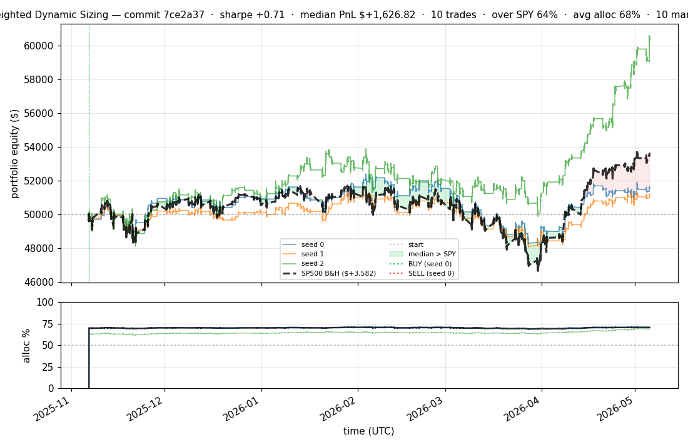
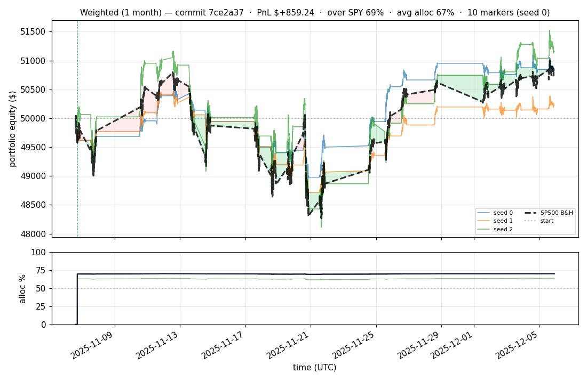
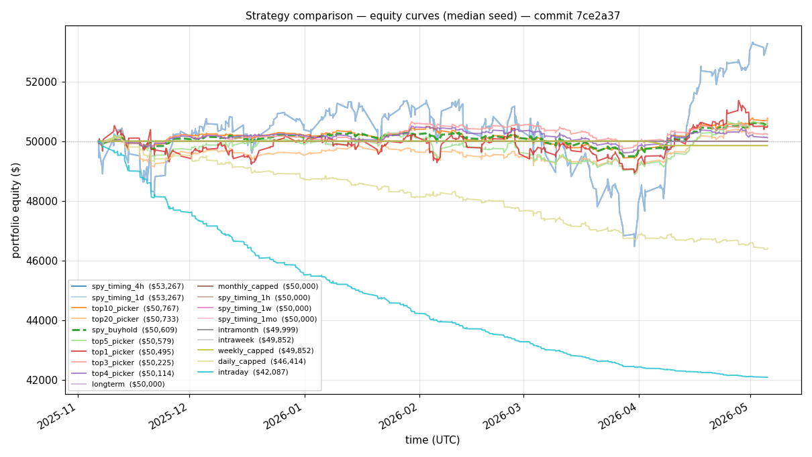
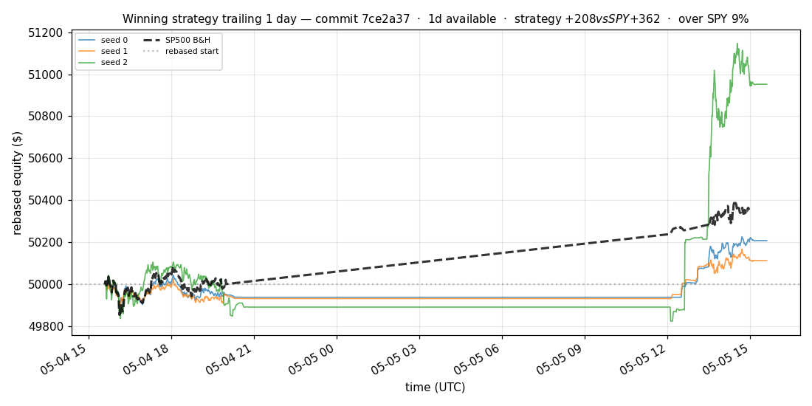
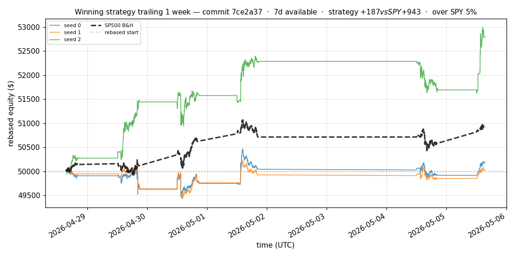
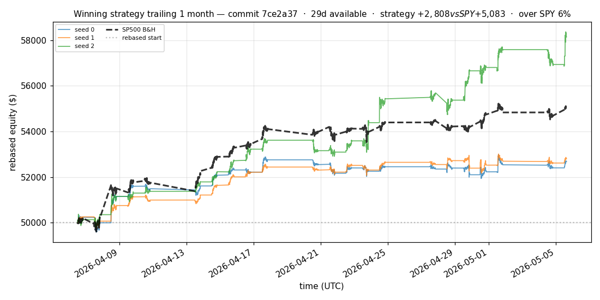
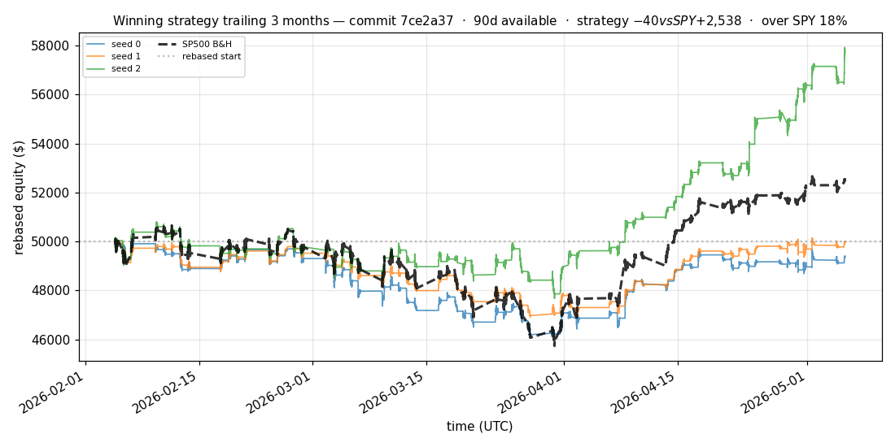
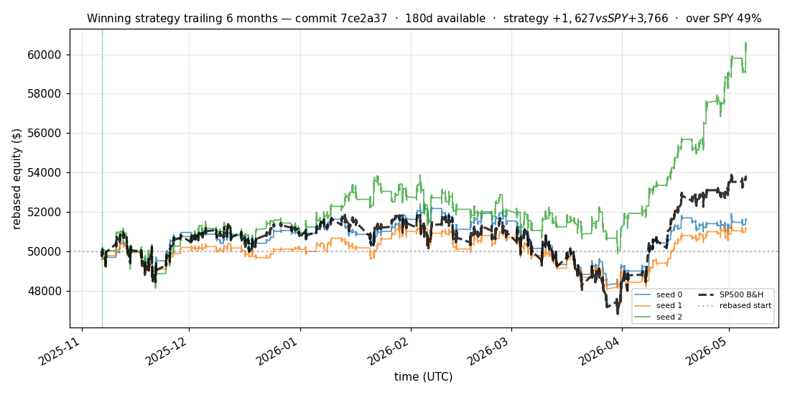

# iter 204 — 7ce2a37

**🔴 DISCARD** · exp204: mid exposure score top10 cached

_2026-05-07 06:01 UTC · 731s wall_

## Result

| metric | value |
|---|---|
| Sharpe (median) | **+0.705** |
| Sharpe CI low (5%) | -1.158 |
| Sharpe CI high (95%) | +2.629 |
| % time above SPY | 64.236% |
| Net PnL | **$+1626.82** (+3.254%) |
| Max drawdown | -8.03% |
| Trades | 10 |
| Fees | $10.00 |
| Seeds completed | 3 |

## Metric Glossary

| metric | meaning |
|---|---|
| Sharpe (median) | Median annualized risk-adjusted return across seeds. Higher is better; it rewards return per unit of volatility, not just raw profit. |
| Sharpe CI low (5%) | Conservative lower-confidence estimate from bootstrap/per-seed variation. This is the main keep/discard gate because it penalizes lucky or unstable runs. |
| Max drawdown (DD) | Worst peak-to-trough portfolio equity decline during the eval window. Less negative is safer; large negative DD means the strategy had a deep loss period. |
| Net PnL | Final profit/loss after fixed fees and modeled slippage/liquidity costs. Positive PnL alone is not enough; it must be robust and beat SPY. |
| % time above SPY | Fraction of eval timestamps where strategy equity was above buy-and-hold SPY/SP500 benchmark. Higher means the strategy stayed ahead for longer. |
| Trades / Fees | Number of executed trades and fixed $1 fees paid. More trades must overcome higher transaction costs. |

**Decision reason:** objective=-0.9328 ≤ prior best +0.0000 (ci_low=-1.1580, over_spy=64.2%, pnl=+3.25%)

## Data Freshness

| metric | value |
|---|---|
| REFRESH_DATA used | no |
| Symbols loaded per seed | 94–94 |
| Earliest latest bar | 2026-05-05 14:58:00+00:00 |
| Latest latest bar | 2026-05-05 15:36:00+00:00 |

## Winning strategy

Canonical strategy for this iteration: **top4 cross-sectional picker** — rank symbols by the transformer's 4h + 1d forecast Sharpe, buy the top four once enough symbols are ready, hold through the eval window, and keep 10 median trades after costs.

A **seed** is one independent training/evaluation run with a different random initialization and sampling path. The gate uses median/worst-tail statistics across seeds so one lucky seed cannot define the best checkpoint.

Positive seed transaction tables are shown later in this report; losing or flat seed transaction tables are omitted to keep reports focused on actionable winners.

## Per-seed details

```
[evaluator] seed 0: sharpe=+0.705  dd=-8.03%  pnl=$+1,626.82  trades=10
[evaluator] seed 1: sharpe=+0.530  dd=-6.43%  pnl=$+1,149.61  trades=10
[evaluator] seed 2: sharpe=+2.544  dd=-7.45%  pnl=$+10,376.95  trades=9
```

## Equity curve (full eval window, 180 calendar days)



## Equity curve (first month)



## Strategy comparison (equity curves)

Overlays every profile (intraday/intraweek/intramonth/longterm + 
daily-capped/weekly-capped/monthly-capped trade-frequency variants 
+ topN pickers + SPY benchmark) on one chart, using the median-seed run.



## Recent live-style simulations vs SP500

Each chart rebases the winning strategy and SP500 to $50,000 at the start of the trailing window, ending at the latest available bar. If an older iteration was evaluated on fewer days than the requested trailing window, the chart title states the actual available coverage instead of implying a full six-month simulation.

### Trailing 1 day



### Trailing 1 week



### Trailing 1 month



### Trailing 3 months



### Trailing 6 months



## Trader profile comparison

Same trained model, different time-horizon strategies + SPY benchmark + passive top-N pickers.

| profile | sharpe | PnL ($) | PnL % | trades | DD % | horizon |
|---|---:|---:|---:|---:|---:|---:|
| **daily_capped** | -6.215 | $-3,585.20 | -7.17% | 749 | -7.56% | 1d |
| **intraday** | -21.241 | $-8,002.64 | -16.01% | 5210 | -16.01% | 2h |
| **intramonth** | -0.636 | $-223.78 | -0.45% | 4 | -0.57% | 30d |
| **intraweek** | -4.723 | $-5,899.96 | -11.80% | 981 | -11.80% | 5d |
| **longterm** | +0.000 | $+0.00 | +0.00% | 4 | -0.57% | 30d |
| **monthly_capped** | +0.000 | $+0.00 | +0.00% | 4 | -0.01% | 30d |
| **spy_buyhold** | +0.975 | $+620.95 | +1.24% | 1 | -1.74% | - |
| **spy_timing_1d** | +0.939 | $+3,321.83 | +6.64% | 1 | -9.79% | 1d |
| **spy_timing_1h** | +0.000 | $+0.00 | +0.00% | 0 | +0.00% | 1h |
| **spy_timing_1mo** | +0.000 | $+0.00 | +0.00% | 0 | +0.00% | 30d |
| **spy_timing_1w** | +0.000 | $+0.00 | +0.00% | 0 | +0.00% | 5d |
| **spy_timing_4h** | +0.939 | $+3,321.83 | +6.64% | 1 | -9.79% | 4h |
| **top10_picker** | +1.244 | $+810.01 | +1.62% | 9 | -4.58% | - |
| **top1_picker** | +0.000 | $+0.00 | +0.00% | 0 | +0.00% | - |
| **top20_picker** | +0.872 | $+783.55 | +1.57% | 19 | -2.97% | - |
| **top3_picker** | +1.428 | $+1,925.12 | +3.85% | 2 | -2.79% | - |
| **top4_picker** | +0.220 | $+112.75 | +0.23% | 3 | -2.81% | - |
| **top5_picker** | +1.455 | $+2,887.62 | +5.78% | 4 | -4.92% | - |
| **weekly_capped** | -1.932 | $-148.27 | -0.30% | 4 | -0.31% | 5d |

**Best active strategy: `top5_picker` (sharpe +1.455) — BEATS SPY ✓**

## Out-of-symbol holdout eval

Tested on **JPM, WMT, V, DIS, JNJ** — large-caps the model NEVER saw during training.

| seed | sharpe | PnL | trades | DD% |
|---:|---:|---:|---:|---:|
| 0 | +1.160 | $+260.45 | 5 | -0.64% |
| 1 | +0.000 | $+0.00 | 0 | +0.00% |
| 2 | +0.000 | $+0.00 | 0 | +0.00% |
| 3 | +0.327 | $+504.54 | 5 | -9.19% |
| 4 | +0.000 | $+0.00 | 0 | +0.00% |

**Median holdout sharpe: +0.000** (vs in-symbol +0.705)

## Per-symbol summary (profitable seeds only)

| symbol | total trades | buys | sells | avg hold (days) | held-to-end |
|---|---:|---:|---:|---:|---:|
| **TSLA** | 5 | 3 | 2 | 76.0 | 1 |
| **AAPL** | 3 | 2 | 1 | 41.9 | 1 |
| **GOOGL** | 3 | 2 | 1 | 146.8 | 1 |
| **AMD** | 3 | 2 | 1 | 150.8 | 1 |
| **PLTR** | 3 | 2 | 1 | 175.8 | 1 |
| **BKNG** | 3 | 2 | 1 | 119.0 | 1 |
| **COIN** | 2 | 1 | 1 | 178.8 | 0 |
| **KO** | 2 | 1 | 1 | 153.8 | 0 |
| **PFE** | 2 | 1 | 1 | 155.0 | 0 |
| **NOW** | 2 | 1 | 1 | 138.0 | 0 |
| **INTU** | 2 | 1 | 1 | 38.9 | 0 |
| **NKE** | 2 | 1 | 1 | 25.0 | 0 |
| **SCHW** | 2 | 1 | 1 | 7.0 | 0 |
| **MCD** | 2 | 1 | 1 | 5.8 | 0 |
| **UNH** | 2 | 1 | 1 | 20.8 | 0 |
| **QCOM** | 2 | 1 | 1 | 25.9 | 0 |
| **QQQ** | 1 | 1 | 0 | — | 1 |
| **SPY** | 1 | 1 | 0 | — | 1 |
| **IWM** | 1 | 1 | 0 | — | 1 |
| **NVDA** | 1 | 1 | 0 | — | 1 |
| **MSFT** | 1 | 1 | 0 | — | 1 |
| **EEM** | 1 | 1 | 0 | — | 1 |
| **AMZN** | 1 | 1 | 0 | — | 1 |
| **XLF** | 1 | 1 | 0 | — | 1 |
| **META** | 1 | 1 | 0 | — | 1 |
| **INTC** | 1 | 1 | 0 | — | 1 |
| **BAC** | 1 | 1 | 0 | — | 1 |
| **XOM** | 1 | 1 | 0 | — | 1 |
| **NFLX** | 1 | 1 | 0 | — | 1 |
| **F** | 1 | 1 | 0 | — | 1 |
| **AVGO** | 1 | 1 | 0 | — | 1 |
| **CMCSA** | 1 | 1 | 0 | — | 1 |
| **ORCL** | 1 | 1 | 0 | — | 1 |
| **NIO** | 1 | 1 | 0 | — | 1 |
| **VRTX** | 1 | 1 | 0 | — | 1 |
| **COST** | 1 | 1 | 0 | — | 1 |
| **REGN** | 1 | 1 | 0 | — | 1 |
| **LIN** | 1 | 1 | 0 | — | 1 |
| **LOW** | 1 | 1 | 0 | — | 1 |
| **BSX** | 1 | 1 | 0 | — | 1 |
| **ABBV** | 1 | 1 | 0 | — | 1 |
| **MO** | 1 | 1 | 0 | — | 1 |
| **LLY** | 1 | 1 | 0 | — | 1 |

## Transactions

### Seed 0 — 67 trades · ending equity $50,417.45 (+417.45 = +0.83%)

| # | timestamp (UTC) | symbol | side |
|---:|---|---|---|
| 1 | 2025-11-06 17:05:00 | QQQ | BUY |
| 2 | 2025-11-06 17:05:00 | SPY | BUY |
| 3 | 2025-11-06 17:07:00 | AAPL | BUY |
| 4 | 2025-11-06 17:07:00 | IWM | BUY |
| 5 | 2025-11-06 17:08:00 | NVDA | BUY |
| 6 | 2025-11-06 17:08:00 | MSFT | BUY |
| 7 | 2025-11-06 17:09:00 | EEM | BUY |
| 8 | 2025-11-06 17:09:00 | AMZN | BUY |
| 9 | 2025-11-06 17:09:00 | XLF | BUY |
| 10 | 2025-11-06 17:09:00 | GOOGL | BUY |
| 11 | 2025-11-06 17:10:00 | META | BUY |
| 12 | 2025-11-06 17:10:00 | TSLA | BUY |
| 13 | 2025-11-06 17:11:00 | INTC | BUY |
| 14 | 2025-11-06 17:11:00 | AMD | BUY |
| 15 | 2025-11-06 17:12:00 | BAC | BUY |
| 16 | 2025-11-06 17:13:00 | PLTR | BUY |
| 17 | 2025-11-06 17:15:00 | XOM | BUY |
| 18 | 2025-11-06 17:17:00 | NFLX | BUY |
| 19 | 2025-11-06 17:17:00 | COIN | BUY |
| 20 | 2025-11-06 17:18:00 | F | BUY |
| 21 | 2025-11-06 17:18:00 | KO | BUY |
| 22 | 2025-11-06 17:22:00 | AVGO | BUY |
| 23 | 2025-11-06 17:48:00 | CMCSA | BUY |
| 24 | 2025-12-01 13:31:00 | PFE | BUY |
| 25 | 2025-12-18 14:30:00 | AAPL | SELL |
| 26 | 2025-12-18 14:30:00 | NOW | BUY |
| 27 | 2025-12-18 14:30:00 | ORCL | BUY |
| 28 | 2025-12-18 14:30:00 | NIO | BUY |
| 29 | 2025-12-18 14:30:00 | VRTX | BUY |
| 30 | 2025-12-18 14:30:00 | BKNG | BUY |
| 31 | 2026-02-27 16:23:00 | INTU | BUY |
| 32 | 2026-04-02 13:31:00 | GOOGL | SELL |
| 33 | 2026-04-02 13:31:00 | NKE | BUY |
| 34 | 2026-04-02 13:31:00 | AAPL | BUY |
| 35 | 2026-04-02 13:31:00 | COST | BUY |
| 36 | 2026-04-02 13:31:00 | REGN | BUY |
| 37 | 2026-04-02 13:31:00 | SCHW | BUY |
| 38 | 2026-04-02 17:37:00 | TSLA | SELL |
| 39 | 2026-04-02 17:37:00 | MCD | BUY |
| 40 | 2026-04-02 17:37:00 | LIN | BUY |
| 41 | 2026-04-02 17:37:00 | LOW | BUY |
| 42 | 2026-04-02 17:37:00 | UNH | BUY |
| 43 | 2026-04-06 13:30:00 | AMD | SELL |
| 44 | 2026-04-07 13:30:00 | INTU | SELL |
| 45 | 2026-04-08 13:30:00 | MCD | SELL |
| 46 | 2026-04-08 15:49:00 | QCOM | BUY |
| 47 | 2026-04-09 13:31:00 | KO | SELL |
| 48 | 2026-04-09 13:32:00 | SCHW | SELL |
| 49 | 2026-04-09 13:32:00 | TSLA | BUY |
| 50 | 2026-04-09 15:49:00 | BSX | BUY |
| 51 | 2026-04-14 13:30:00 | TSLA | SELL |
| 52 | 2026-04-15 16:19:00 | ABBV | BUY |
| 53 | 2026-04-16 13:30:00 | BKNG | SELL |
| 54 | 2026-04-23 13:30:00 | UNH | SELL |
| 55 | 2026-04-23 13:30:00 | TSLA | BUY |
| 56 | 2026-04-27 13:30:00 | NKE | SELL |
| 57 | 2026-04-27 13:30:00 | AMD | BUY |
| 58 | 2026-04-28 20:26:00 | BKNG | BUY |
| 59 | 2026-05-01 13:30:00 | PLTR | SELL |
| 60 | 2026-05-01 16:17:00 | MO | BUY |
| 61 | 2026-05-04 13:30:00 | COIN | SELL |
| 62 | 2026-05-04 13:31:00 | QCOM | SELL |
| 63 | 2026-05-04 13:31:00 | GOOGL | BUY |
| 64 | 2026-05-04 14:20:00 | LLY | BUY |
| 65 | 2026-05-05 13:30:00 | PFE | SELL |
| 66 | 2026-05-05 13:31:00 | NOW | SELL |
| 67 | 2026-05-05 13:31:00 | PLTR | BUY |

## Diff vs previous experiment

```diff
7ce2a37 exp204: test mid exposure top10 allocation


 experiment.py | 9 ++++-----
 1 file changed, 4 insertions(+), 5 deletions(-)
```

---

[← all iterations](.) · [back to README](../README.md)
