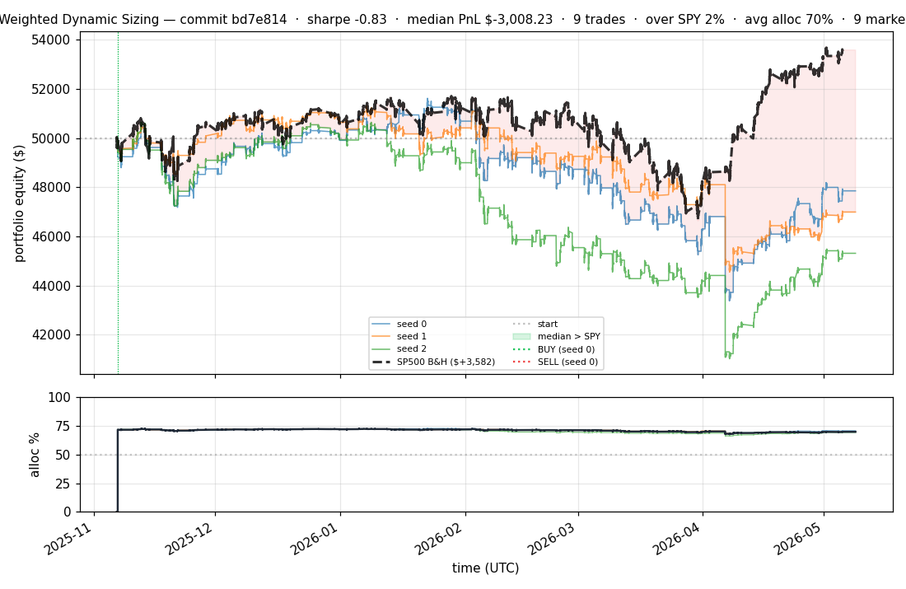
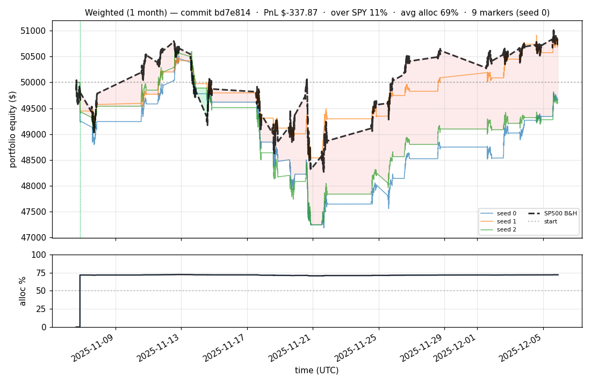
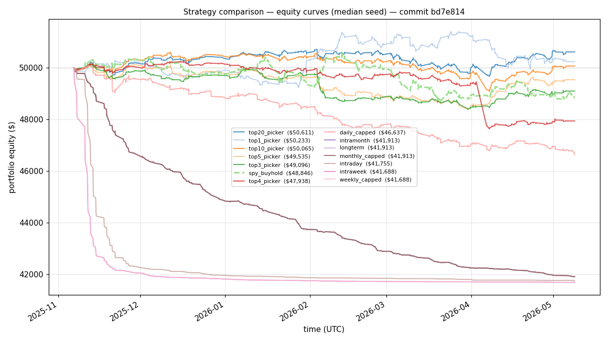
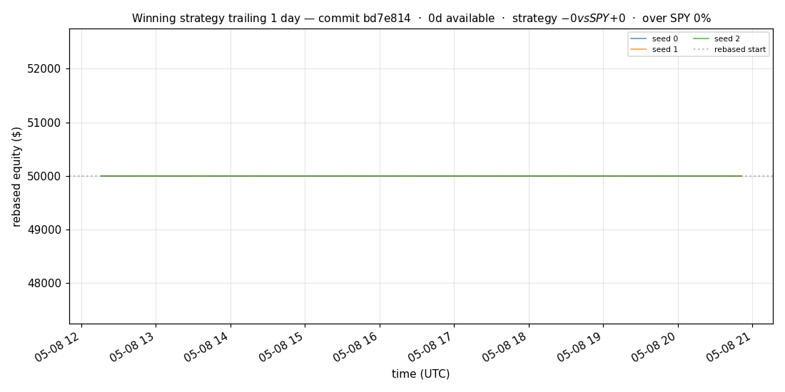
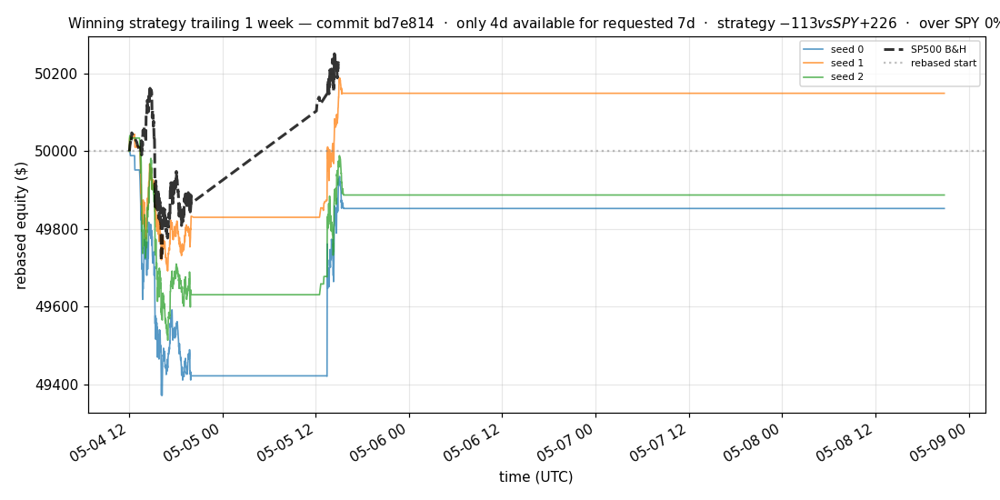
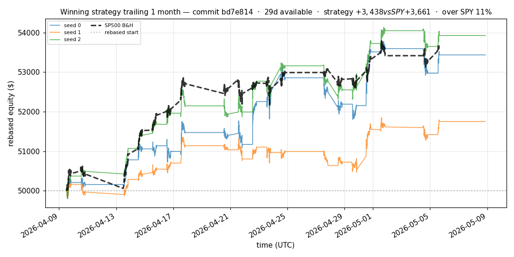
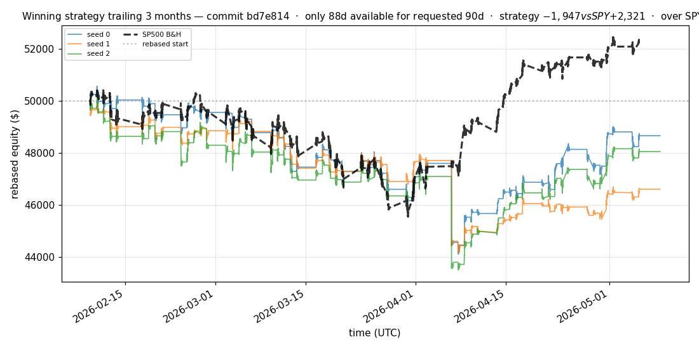
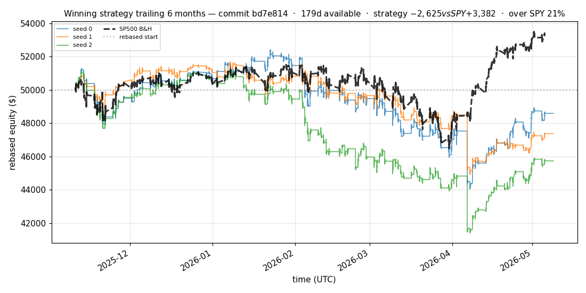

# iter 207 — bd7e814

**🔴 DISCARD** · exp207: top100 LeWorld JEPA, canonical score top10 SPY-trend; top20 diagnostic beat SPY

_2026-05-09 10:06 UTC · 4323s evaluator wall; JEPA continuation finished 2026-05-09 12:56 local_

## Result

| metric | value |
|---|---|
| Sharpe (median) | **-0.830** |
| Sharpe CI low (5%) | -2.594 |
| Sharpe CI high (95%) | +1.843 |
| % time above SPY | 1.825% |
| Net PnL | **$-3008.23** (-6.016%) |
| Max drawdown | -19.00% |
| Trades | 9 |
| Fees | $9.00 |
| Seeds completed | 3 |

**Decision reason:** discard. The canonical `score_alloc_top10_spytrend` strategy lost money and violated the drawdown floor: max DD -19.00% < -15.0%.

## What Was Tested

- Current S&P 500 table parsed into 503 tradable symbols.
- Cache expanded to 194 one-minute parquet files; the first 100 S&P symbols were fully cached.
- Training/eval limited to the first 100 S&P 500 symbols for this iteration.
- LeWorld-style JEPA pretraining used latent next-window prediction plus Gaussian latent regularization.
- Evaluator run used `MARKET_JEPA_MAX_STEPS=250`, `PRETRAIN_MAX_STEPS=500`, and `RL_PRETRAIN_EPOCHS=0`.
- After evaluation, JEPA was continued for 2,000 additional LeWorld steps per seed and saved to `checkpoints/last_seed{0,1,2}.pt`.

## SPY Benchmark Result

The canonical strategy did **not** beat SPY. SPY buy-and-hold was the better strategy in the generated strategy comparison.

| strategy | Sharpe | PnL | PnL % | Max DD | Trades |
|---|---:|---:|---:|---:|---:|
| Canonical score_alloc_top10_spytrend | -0.830 | $-3,008.23 | -6.016% | -19.00% | 9 |
| SPY buy-and-hold benchmark | +1.008 | $+3,581.80 | +7.164% | -9.79% | 1 |

The canonical equity curve was above SPY only **1.825%** of eval timestamps.

## Positive Signal: Top20 Diagnostic

The broad top20 diagnostic was positive on every seed and beat the SPY profile in these top100 diagnostics. This suggests the representation/ranking signal may be useful, but the judged top10-spytrend canonical policy is the wrong policy for this wider universe.

| seed | top20 Sharpe | top20 PnL | top20 DD | top10 Sharpe | SPY Sharpe | SPY PnL |
|---:|---:|---:|---:|---:|---:|---:|
| 0 | +0.934 | $+610.63 | -2.14% | -0.481 | -1.353 | $-1,152.12 |
| 1 | +0.744 | $+504.27 | -2.40% | +0.099 | -1.353 | $-1,152.12 |
| 2 | +1.060 | $+644.86 | -2.11% | +0.526 | -1.353 | $-1,152.12 |

## JEPA Continuation

After the evaluator, the existing three seed checkpoints were continued with LeWorld JEPA only:

| seed | added JEPA steps | batch | sigreg | symbols |
|---:|---:|---:|---:|---:|
| 0 | 2000 | 128 | 0.05 | 100 |
| 1 | 2000 | 128 | 0.05 | 100 |
| 2 | 2000 | 128 | 0.05 | 100 |

## Per-Seed Canonical Details

```
[evaluator] seed 0: sharpe=-0.483  dd=-15.95%  pnl=$-2,146.96  trades=9
[evaluator] seed 1: sharpe=-0.830  dd=-13.17%  pnl=$-3,008.23  trades=9
[evaluator] seed 2: sharpe=-1.158  dd=-19.00%  pnl=$-4,686.36  trades=9
```

## Out-of-Symbol Holdout Eval

Tested on JPM, WMT, V, DIS, JNJ. Holdout was unstable across seeds.

| seed | sharpe | PnL | trades | DD |
|---:|---:|---:|---:|---:|
| 0 | -56.489 | $-8,127.00 | 5876 | -16.25% |
| 1 | +1.937 | $+1,167.03 | 5 | -1.48% |
| 2 | -56.362 | $-2,749.55 | 2260 | -5.50% |

## Equity Curve



## First Month



## Strategy Comparison vs SPY



## Recent Live-Style Charts vs SP500











← [back to iterations](README.md)
