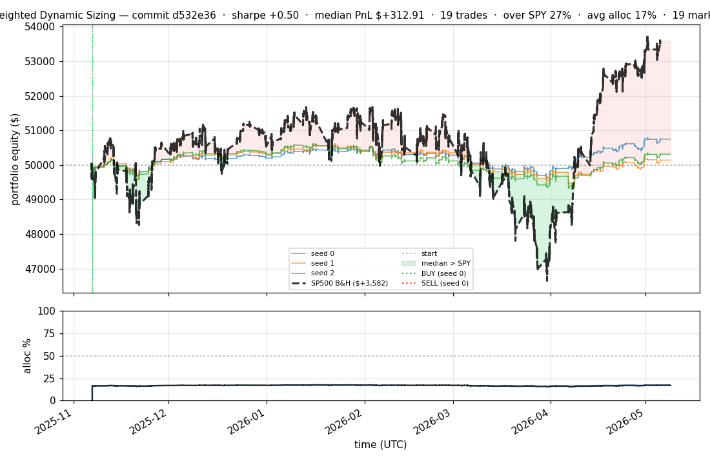
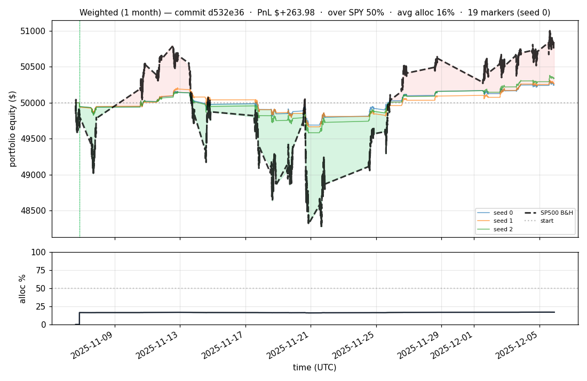
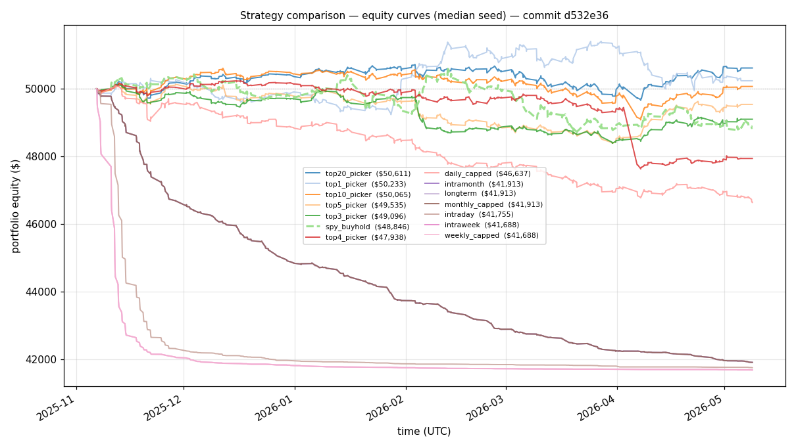
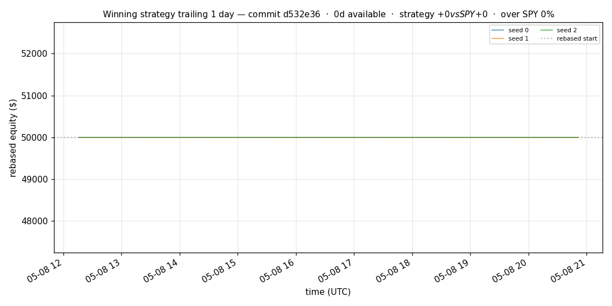
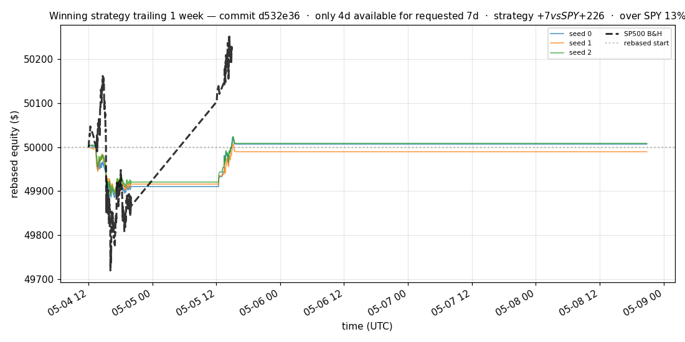
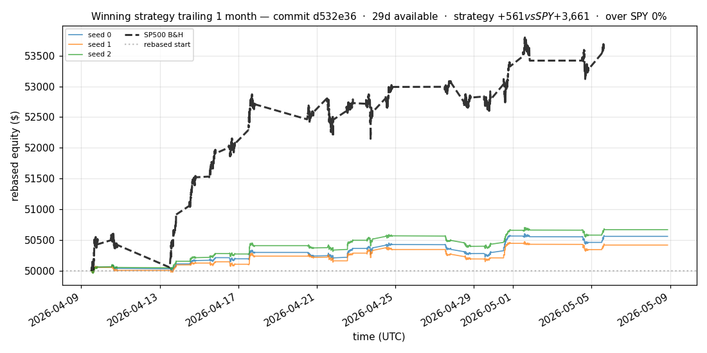
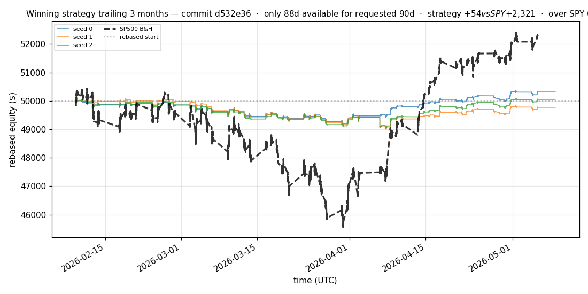
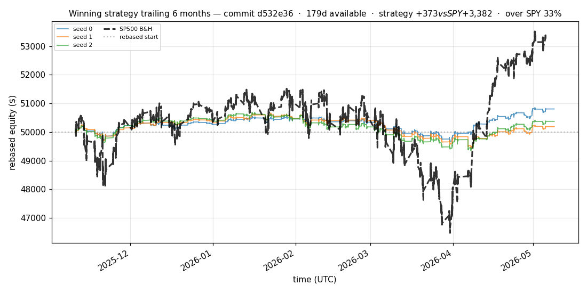

# iter 208 — d532e36

**🔴 DISCARD** · exp208b: top100 cross-symbol hard JEPA top20 canonical

_2026-05-09 11:48 UTC · 1113s evaluator wall; hard cross-symbol JEPA continuation added 2026-05-09 local_

## Result

| metric | value |
|---|---|
| Sharpe (median) | **+0.496** |
| Sharpe CI low (5%) | -1.777 |
| Sharpe CI high (95%) | +2.966 |
| % time above SPY | 26.817% |
| Net PnL | **$+312.91** (+0.626%) |
| Max drawdown | -2.64% |
| Trades | 19 |
| Fees | $19.00 |
| Seeds completed | 3 |

**Decision reason:** discard. The top20 canonical picker made money and held drawdown low, but the lower confidence bound stayed negative and SPY buy-and-hold still had higher Sharpe and higher net PnL.

## What Was Tested

- The top20 diagnostic strategy from iter 207 was promoted to canonical via `CANONICAL_STRATEGY=topn` and `CANONICAL_TOP_N=20`.
- The expensive profile suite was disabled for this bounded check with `RUN_PROFILE_SUITE=0`.
- Existing top100 checkpoints were continued with a harder LeWorld JEPA target: visible context from one symbol, missing future target from a different symbol.
- Hard JEPA ran for 1,000 additional steps per seed using `MARKET_JEPA_TARGET_MODE=cross_symbol`, `MARKET_JEPA_BATCH=128`, and `MARKET_JEPA_SIGREG_COEF=0.05`.
- Evaluation reused the cached checkpoints with `USE_CACHED_PRETRAIN=1` across the first 100 cached S&P 500 symbols.

## SPY Benchmark Result

The strategy improved materially versus the original iter 207 canonical policy, but it still did **not** beat SPY on Sharpe or total PnL.

| strategy | Sharpe | PnL | PnL % | Max DD | Trades | % time above SPY |
|---|---:|---:|---:|---:|---:|---:|
| Cross-symbol hard-JEPA top20 canonical | +0.496 | $+312.91 | +0.626% | -2.64% | 19 | 26.817% |
| SPY buy-and-hold benchmark | +1.008 | $+3,581.80 | +7.164% | -9.79% | 1 | 0.000% |

## Comparison To Previous Top20 Check

The harder JEPA target helped the weak seed recover from slightly negative to positive PnL, but reduced the median result versus the easier cached top20 run.

| run | seed 0 | seed 1 | seed 2 | median Sharpe | median PnL | median DD |
|---|---:|---:|---:|---:|---:|---:|
| Cached top20 after temporal JEPA continuation | +1.228 / $+658.71 | -0.008 / $-11.12 | +0.603 / $+391.01 | +0.603 | $+391.01 | -2.62% |
| Cross-symbol hard-JEPA top20 | +1.367 / $+747.83 | +0.234 / $+139.48 | +0.496 / $+312.91 | +0.496 | $+312.91 | -2.64% |

## JEPA Continuation

| seed | added hard-JEPA steps | target mode | final avg loss | pred loss | sigreg loss |
|---:|---:|---|---:|---:|---:|
| 0 | 1000 | cross_symbol | 0.0468 | 0.0034 | 0.8677 |
| 1 | 1000 | cross_symbol | 0.0469 | 0.0032 | 0.8742 |
| 2 | 1000 | cross_symbol | 0.0469 | 0.0032 | 0.8739 |

## Per-Seed Canonical Details

```
[evaluator] seed 0: sharpe=+1.367  dd=-1.83%  pnl=$+747.83  trades=19
[evaluator] seed 1: sharpe=+0.234  dd=-2.46%  pnl=$+139.48  trades=19
[evaluator] seed 2: sharpe=+0.496  dd=-2.64%  pnl=$+312.91  trades=19
```

## Takeaway

Cross-symbol masking is useful as a robustness test: it removed the flat/negative seed, which means it likely improves representation stability. It is not yet the best training recipe because the easier temporal-continuation top20 run had a better median Sharpe and PnL.

Next best experiment: do **one** longer base-training run, not another seed validation. Use `MARKET_JEPA_TARGET_MODE=mixed` so half the JEPA batches preserve same-symbol temporal dynamics and half force cross-symbol inference, increase both JEPA and supervised/ranking budgets to roughly 10,000 steps, and evaluate the same top20 canonical policy. Only run 3 seeds after the single long run shows a real improvement.

## Equity Curve



## First Month



## Strategy Comparison vs SPY



## Recent Live-Style Charts vs SP500











← [back to iterations](README.md)
