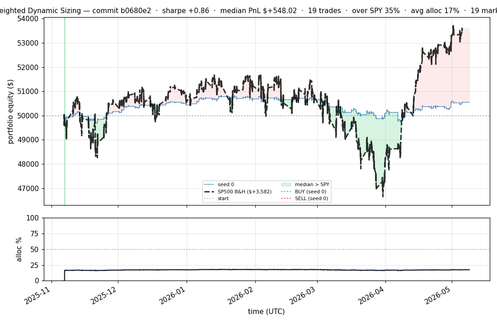
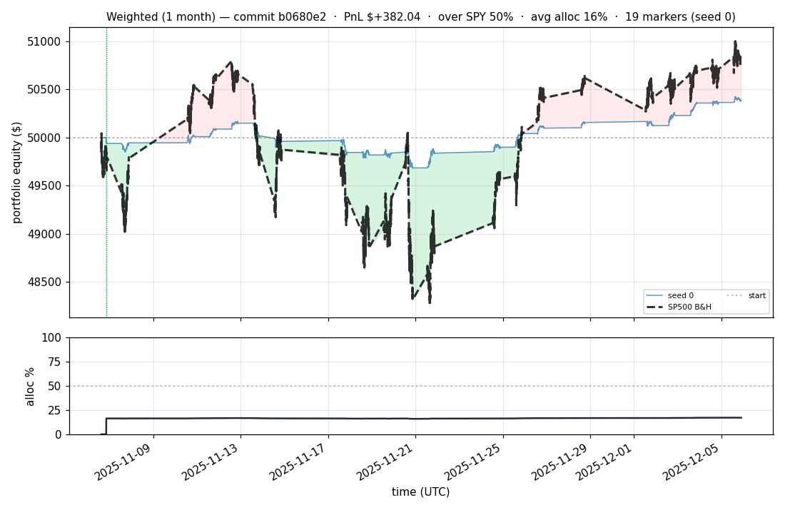
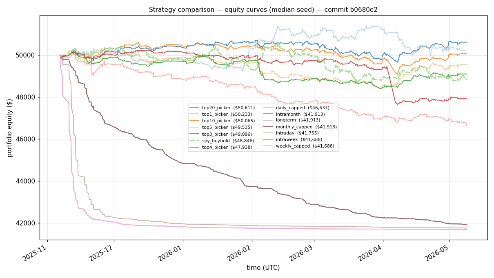
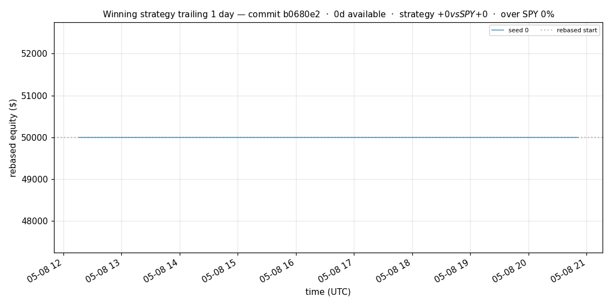
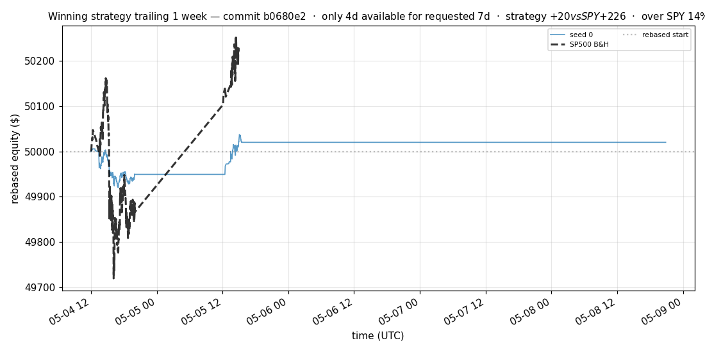
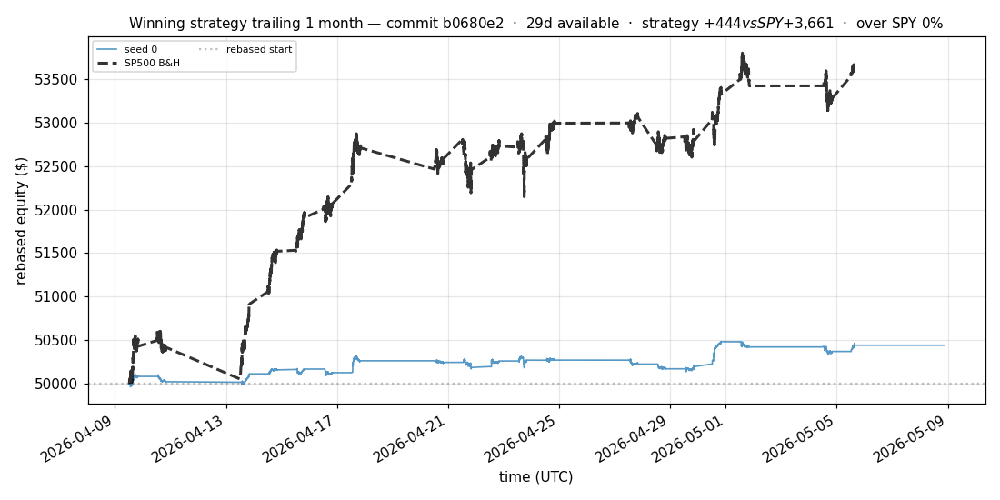
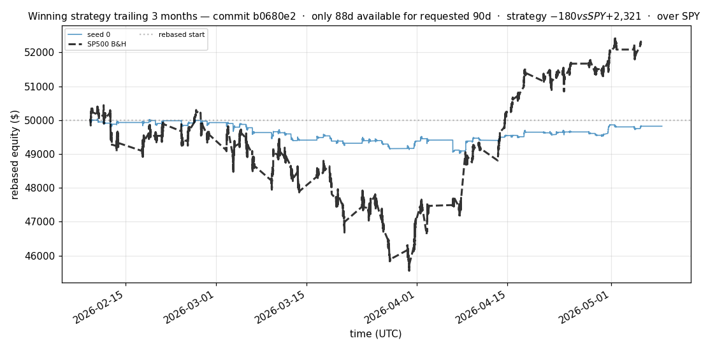
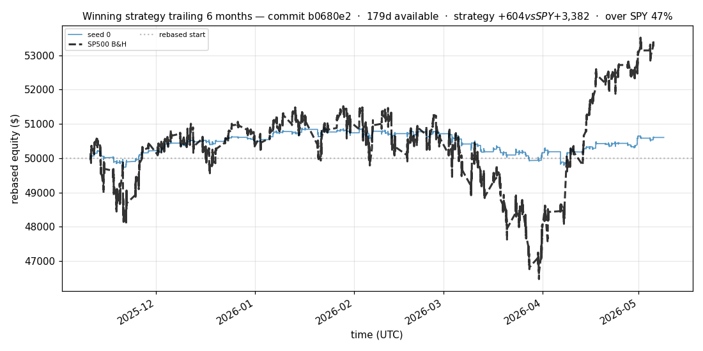

# iter 209 — bf1bed0

**🔴 DISCARD** · exp209: one-seed MPS long mixed JEPA top20 canonical

_2026-05-10 16:09 UTC · 2958s evaluator wall_

## Result

| metric | value |
|---|---|
| Sharpe (single seed) | **+0.856** |
| Sharpe CI low (bootstrap) | -1.446 |
| Sharpe CI high (bootstrap) | +3.041 |
| % time above SPY | 35.165% |
| Net PnL | **$+548.02** (+1.096%) |
| Max drawdown | -2.15% |
| Trades | 19 |
| Fees | $19.00 |
| Seeds completed | 1 |

**Decision reason:** discard for now. This was intentionally a single-seed exploratory training run, not a robustness validation. It improved the top20 canonical result versus the prior hard-JEPA median, but SPY still had higher Sharpe and much higher PnL.

## What Was Tested

- Apple MPS was enabled with `TRY_MPS=1`.
- JEPA and supervised/ranking batch sizes were increased to 256.
- Mixed LeWorld JEPA ran for 5 capped epochs: `MARKET_JEPA_TARGET_MODE=mixed`, `MARKET_JEPA_EPOCHS=5`, `MARKET_JEPA_MAX_STEPS=5000`.
- Supervised/ranking pretraining ran for 5 capped epochs: `PRETRAIN_EPOCHS=5`, `PRETRAIN_MAX_STEPS=5000`.
- The canonical policy was the top20 picker on the first 100 cached S&P 500 symbols.
- The profile suite was disabled with `RUN_PROFILE_SUITE=0`.

## Training Signal

JEPA improved quickly and mostly plateaued after epoch 3.

| phase | epoch | loss | pred loss | sigreg |
|---|---:|---:|---:|---:|
| mixed JEPA | 1 | 0.0476 | 0.0068 | 0.8155 |
| mixed JEPA | 2 | 0.0412 | 0.0021 | 0.7820 |
| mixed JEPA | 3 | 0.0400 | 0.0023 | 0.7533 |
| mixed JEPA | 4 | 0.0397 | 0.0021 | 0.7510 |
| mixed JEPA | 5 | 0.0396 | 0.0021 | 0.7504 |

Supervised/ranking loss kept improving through epoch 5.

| epoch | nll | multi-horizon nll | rank |
|---:|---:|---:|---:|
| 1 | -6.9535 | -3.4368 | 0.0500 |
| 2 | -7.9616 | -3.8994 | 0.0500 |
| 3 | -8.6671 | -4.1818 | 0.0500 |
| 4 | -9.1060 | -4.3572 | 0.0500 |
| 5 | -9.4649 | -4.5305 | 0.0500 |

## SPY Benchmark Result

| strategy | Sharpe | PnL | PnL % | Max DD | Trades | % time above SPY |
|---|---:|---:|---:|---:|---:|---:|
| MPS long mixed-JEPA top20 canonical | +0.856 | $+548.02 | +1.096% | -2.15% | 19 | 35.165% |
| SPY buy-and-hold benchmark | +1.008 | $+3,581.80 | +7.164% | -9.79% | 1 | 0.000% |

## Per-Seed Canonical Details

```
[evaluator] seed 0: sharpe=+0.856  dd=-2.15%  pnl=$+548.02  trades=19
```

## Takeaway

Longer mixed-JEPA plus longer supervised/ranking training improves the exploratory top20 result, and MPS makes the run practical. The base model is likely still underpowered for the desired trading world-model goal: it can find positive low-drawdown baskets, but it does not yet predict enough edge to beat SPY.

Next best move: build the separate action-conditioned portfolio world-model dataset instead of continuing to stretch this old forecaster architecture.

## Equity Curve



## First Month



## Strategy Comparison vs SPY



## Recent Live-Style Charts vs SP500











← [back to iterations](README.md)
